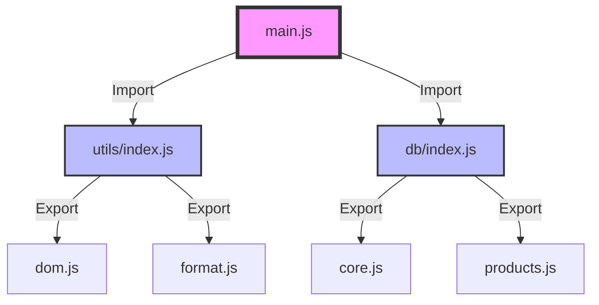

# HARI 1: Bedah Anatomi & Fondasi Modern JavaScript

**Selamat Datang di "Bengkel Kode" POS Lite Project.** 🛠️

Hari ini adalah hari terpenting.
Banyak pemula gagal bukan karena kodenya susah, tapi karena **fondasinya rapuh**.
Mereka copy-paste tanpa paham "kenapa" kodenya begitu, dan panik saat error muncul.

Hari ini kita tidak akan sekadar "mengetik". Kita akan menjadi **Ahli Bedah**. Kita akan membedah setiap baris kode yang kita tulis untuk memahami *organ dalam* dari aplikasi ini.

**Target Utama Hari Ini:**
1.  **Mental Model:** Memahami bagaimana JavaScript Modern bekerja di balik layar.
2.  **Architecture:** Membangun struktur folder yang *scalable* (bisa tumbuh besar).
3.  **Tooling:** Membuat "Kotak Perkakas" (`utils`) yang akan meningkatkan kecepatan coding kita 10x lipat di hari-hari berikutnya.

---

## BAGIAN 1: 🔬 Anatomi Syntax (Fundamental Knowledge)

Sebelum kita menyentuh text editor, kita harus menyamakan frekuensi.
JavaScript tahun 2015 (ES6) beda jauh dengan JavaScript tahun 2010.
Jika kamu masih bingung simbol `=>` atau `...` atau `import`, baca bagian ini sampai paham.

### 1. `const` dan `let` (Variabel)
*Dulu kita pakai `var`. Sekarang kita "haramkan" `var`.*

*   **WHAT (Apa):** Cara mendeklarasikan variabel (tempat simpan data).
*   **WHY (Kenapa):**
    *   `var` itu "bocor". Dia bisa diakses dari luar blok `{ }` (Function Scoped). Ini sumber bug yang sulit dilacak.
    *   `const` dan `let` patuh pada aturan blok (Block Scoped). Mereka mati jika keluar dari kurung kurawal `{ }`.
*   **WHEN (Kapan):**
    *   Gunakan **`const`** (Constant) untuk 95% kasus. Anggaplah variabel itu sakral dan tidak boleh diganti isinya.
    *   Gunakan **`let`** HANYA jika kamu yakin nilainya PASTI berubah (misal: skor game, penghitung loop `i++`).
*   **ANATOMI:**
    ```javascript
    // ✅ BENAR
    const namaAplikasi = "POS Lite"; // Tidak akan berubah
    let keranjang = 0;              // Akan berubah nanti
    
    // ❌ SALAH (Error)
    const pi = 3.14;
    pi = 5; // ERROR: Assignment to constant variable.
    ```

### 2. Arrow Function `() => {}`
*Simbol panah ini ada di mana-mana. Jangan takut.*

*   **WHAT:** Cara singkat (shorthand) menulis fungsi.
*   **WHY:** Lebih ringkas, dan dia punya sifat spesial dalam menangani `this` (Lexical Scoping).
*   **ANATOMI:**
    ```javascript
    // 👵 Cara Nenek Moyang (Function Declaration)
    function sapa(nama) {
        return "Halo " + nama;
    }

    // 🚀 Cara Modern (Arrow Function)
    // "Konstanta 'sapa' adalah sebuah fungsi yang menerima 'nama'..."
    const sapa = (nama) => {
        return `Halo ${nama}`;
    };
    
    // 🔥 Cara Super Singkat (Implicit Return)
    // Jika isi fungsi cuma 1 baris, kurung kurawal {} dan kata 'return' boleh dibuang!
    const sapa = (nama) => `Halo ${nama}`;
    ```

### 3. Template Literals `` ` ` `` (Backticks)
*Perhatikan tanda kutip miring (backtick) di sebelah angka 1 keyboardmu.*

*   **WHAT:** String super sakti yang bisa disisipi variabel dan bisa multi-baris (enter).
*   **HOW:** Pakai `${...}` untuk menyisipkan variabel (Interpolation).
*   **CONTOH:**
    ```javascript
    const barang = "Kopi";
    const harga = 5000;
    
    // Kuno (Ribet plus-plus)
    const struk = "Barang: " + barang + "\n" + "Harga: " + harga;
    
    // Modern (Bersih)
    const struk = `
      Barang: ${barang}
      Harga:  ${harga}
    `;
    ```

### 4. Modules (`import` / `export`) 📦
*Ini adalah pondasi arsitektur kita.*

*   **WHAT:** Cara memecah aplikasi menjadi file-file kecil (puzzle).
*   **WHY:** Bayangkan jika 1000 baris kode ada di satu file `script.js`. Pusing kan? Kita pecah jadi `db.js`, `auth.js`, dll.
*   **ANALOGI:**
    *   **Export**: Toko yang memajang barang di etalase. "Ini boleh diambil orang luar".
    *   **Import**: Pembeli yang mengambil barang dari etalase toko lain.

**Visualisasi Alur Module:**



*   **SYARAT MUTLAK:** Di HTML, script tag harus punya `type="module"`.
    `<script type="module" src="js/main.js"></script>`

### 5. Rest Parameter `...` (Titik Tiga Sakti) ✨
*Kamu akan sering melihat `...children` atau `...props`.*

*   **WHAT:** Simbol untuk "Menyedot" sisa argumen menjadi Array.
*   **CONTEXT:** Di fungsi `buatElemen`, kita pakai untuk menangkap anak-anak elemen (children).
*   **ANATOMI:**
    ```javascript
    // "...sisa" akan menangkap semua input tambahan menjadi ARRAY
    function masak(menuUtama, ...sisa) {
        console.log(menuUtama); // "Nasi Goreng"
        console.log(sisa);      // ["Kerupuk", "Acar", "Teh"] (Jadi Array!)
    }
    
    masak("Nasi Goreng", "Kerupuk", "Acar", "Teh");
    ```

### 6. Object Destructuring `{ }` 🎁
*   **WHAT:** Membongkar isi object langsung saat deklarasi variabel.
*   **ANATOMY:**
    ```javascript
    const user = { nama: "Siti", umur: 20, kota: "Jakarta" };
    
    // Bongkar langsung!
    // Kita menampung value 'nama' ke variabel baru bernama 'nama'
    const { nama, kota } = user;
    
    console.log(nama); // "Siti"
    // Tidak perlu tulis user.nama lagi
    ```

---

## BAGIAN 2: 🧠 Under The Hood (Teori Mendalam)

*Bagian ini untuk kamu yang ingin tahu cara kerja mesin, bukan cuma nyetir mobil.*

### Bagaimana JS Mengeksekusi Kode? (Execution Context)

Saat browser membaca kodemu, dia tidak langsung jalan. Dia melakukan 2 fase:

1.  **Creation Phase (Fase Pembuatan):**
    *   Browser memindai seluruh kodemu.
    *   Dia mencatat semua variabel (`var`, `function`).
    *   Inilah kenapa `function` biasa bisa dipanggil *sebelum* ditulis (Hoisting).
    *   Tapi `const` dan `let` **TIDAK** kena hoisting (tetap error kalau diakses sebelum dideklarasi).

    ```javascript
    // ✅ Aman
    sapa(); 
    function sapa() {}

    // ❌ Error (ReferenceError)
    panggil();
    const panggil = () => {}; 
    ```

2.  **Execution Phase (Fase Eksekusi):**
    *   Browser menjalankan kode baris demi baris dari atas ke bawah.
    *   Jika ketemu fungsi, dia membuat "kotak baru" (New Execution Context) dan menumpuknya di **Call Stack**.

**Visualisasi Call Stack:**
Bayangkan tumpukan piring.

1.  `main()` masuk.
2.  `buatElemen()` dipanggil -> tumpuk di atas `main`.
3.  `document.createElement()` dipanggil -> tumpuk di atas `buatElemen`.
4.  `document.createElement()` selesai -> piring diambil (pop).
5.  `buatElemen()` selesai -> piring diambil (pop).
6.  Kembali ke `main`.

---

## BAGIAN 3: 🏗️ Pembangunan Milestones (Langkah demi Langkah)

Sekarang, kita terapkan teori di atas untuk membangun pondasi POS Lite dari NOL.
Ikuti langkah ini persis. Jangan lompat.

### Milestone 1: Arsitektur Folder (Denah Rumah)

Buatlah folder proyek baru bernama `pos-lite-student`.
Di dalamnya, buat struktur folder seperti ini. **Pahami fungsi setiap foldernya:**

| Folder/File | Fungsi (Analogi Rumah) | Detail |
| :--- | :--- | :--- |
| `index.html` | **Pintu Depan**. | Satu-satunya file HTML yang diakses browser. |
| `styles.css` | **Cat & Dekorasi**. | Agar rumah tidak terlihat seperti semen kasar. |
| `js/` | **Kabel Listrik & Otak**. | Semua logika JavaScript ada di sini. |
| `js/utils/` | **Kotak Perkakas**. | Palu, obeng, tang. Fungsi kecil yang membantu fungsi besar. |
| `js/db/` | **Gudang**. | Tempat menyimpan data (Database). |
| `js/main.js` | **Saklar Utama**. | Titik pusat yang menyalakan dan menghubungkan modul. |

**Tugas:** Buat folder & file kosong sesuai tabel di atas.

---

### Milestone 2: Membuat Perkakas Ajaib (`js/utils/dom.js`)

Kita akan menghindari menulis `document.createElement` berulang-ulang. Kita akan membuat fungsi pembantu bernama `buatElemen`.
Ini adalah kode tersulit hari ini, tapi paling berguna (Utility). Simpan ini baik-baik, kamu bisa pakai di proyek lain seumur hidupmu.

**Buka `js/utils/dom.js` lalu ketik kode ini:**

```javascript
/**
 * FUNGSI: buatElemen
 * Tugas: Membuat elemen HTML lewat JavaScript dengan rapi (mirip React).
 * 
 * Parameter:
 * 1. tag      : Nama elemen (misal: 'div', 'h1', 'button')
 * 2. props    : Properti/Atribut (misal: { id: 'judul', className: 'teks-biru' })
 * 3. ...children : Isi elemen (bisa teks, bisa elemen lain) -> Ditangkap jadi Array
 */
export function buatElemen(tag, props = {}, ...children) {
    // 1. Buat elemen kosong dulu
    const elemen = document.createElement(tag);

    // 2. Pasang atributnya (jika ada)
    if (props) {
        // Object.entries mengubah { a: 1, b: 2 } menjadi [ ['a', 1], ['b', 2] ]
        // Tujuannya agar bisa kita loop satu-satu
        Object.entries(props).forEach(([key, value]) => {
            
            // A. Cek apakah ini Event Listener? (Diawali kata 'on', misal: onClick)
            if (key.startsWith('on') && typeof value === 'function') {
                // Hapus kata 'on', lalu kecilkan hurufnya (onClick -> click)
                const namaEvent = key.substring(2).toLowerCase();
                elemen.addEventListener(namaEvent, value);
            } 
            // B. Cek apakah ini Class? (Biar mirip React kita pakai className)
            else if (key === 'className') {
                elemen.className = value;
            } 
            // C. Handle Dataset (data-id, data-role, dll)
            else if (key === 'dataset' && typeof value === 'object') {
                Object.assign(elemen.dataset, value);
            }
            // D. Sisanya adalah atribut biasa (id, src, type, placeholder)
            else {
                elemen.setAttribute(key, value);
            }
        });
    }

    // 3. Masukkan isinya (Anak-anaknya)
    children.forEach(anak => {
        // Jika anaknya cuma teks atau angka (Basic Primitive)
        if (typeof anak === 'string' || typeof anak === 'number') {
            elemen.appendChild(document.createTextNode(anak));
        } 
        // Jika anaknya adalah Element HTML juga (Node)
        else if (anak instanceof Node) {
            elemen.appendChild(anak);
        }
        // Jika anaknya adalah Array (Nested Children)
        else if (Array.isArray(anak)) {
            anak.forEach(c => {
                if (c) elemen.appendChild(c);
            });
        }
    });

    // 4. Kembalikan elemen yang sudah jadi
    return elemen;
}
```

**Analisis Kode:**
-   `...children` adalah Rest Parameter. Dia membolehkan kita memasukkan jumlah anak bebas (1 anak, 5 anak, atau 100 anak).
-   `Object.entries` adalah cara modern melakukan looping object.
-   Fungsi ini adalah implementasi kasar dari `React.createElement`. Kita sedang membuat Mini-React!

---

### Milestone 3: Format Uang (`js/utils/format.js`)

Aplikasi kasir tanpa format Rupiah bagaikan sayur tanpa garam.
Kita gunakan `Intl.NumberFormat` bawaan browser.

**Buka `js/utils/format.js`:**

```javascript
/**
 * FUNGSI: formatKeRupiah
 * Tugas: Mengubah angka polosan 15000 jadi string cantik "Rp 15.000"
 */
export function formatKeRupiah(angka) {
    // Intl adalah fitur bawaan browser yang canggih untuk format bahasa
    return new Intl.NumberFormat('id-ID', {
        style: 'currency',  // Gaya mata uang
        currency: 'IDR',    // Mata uang Rupiah
        minimumFractionDigits: 0 // Tidak usah pakau ,00 di belakang (ribet)
    }).format(angka);
}
```

---

### Milestone 4: Gerbang Tool (`js/utils/index.js`)

Agar file lain gampang mengimpor, kita jadikan satu pintu (Barrel File).
Bayangkan ini seperti "Lobby Hotel". Orang tidak perlu tahu kamar nomor berapa, cukup tanya resepsionis.

**Buka `js/utils/index.js`:**
```javascript
// Export semua (*) yang ada di file dom.js
export * from './dom.js';

// Export semua (*) yang ada di file format.js
export * from './format.js';

// Nanti kalau ada file baru, tinggal tambah di sini.
```

---

### Milestone 5: Panggung Utama (`index.html`)

Kita butuh kanvas kosong untuk menggambar aplikasi kita.

**Buka `index.html`:**
```html
<!DOCTYPE html>
<html lang="id">
<head>
    <meta charset="UTF-8">
    <meta name="viewport" content="width=device-width, initial-scale=1.0">
    <title>POS Lite - Hari 1</title>
    <!-- Hubungkan CSS -->
    <link rel="stylesheet" href="styles.css">
</head>
<body>
    
    <!-- HEADER SEDERHANA -->
    <header style="padding: 20px; border-bottom: 2px solid #ddd;">
        <h1>POS Lite 🚀</h1>
    </header>

    <!-- 
        WADAH KOSONG (Container)
        Di sinilah JavaScript akan menyuntikkan (inject) seluruh aplikasi kita.
        Biarkan kosong! JS yang akan bekerja.
    -->
    <main id="aplikasi" style="padding: 20px;"></main>

    <!-- 
        PENTING: type="module" 
        Wajib ada agar browser tahu kita pakai import/export modern.
        Tanpa ini, codingan kita error "Cannot use import statement..."
    -->
    <script type="module" src="js/main.js"></script>
</body>
</html>
```

---

### Milestone 6: Menghidupkan Mesin (`js/main.js`)

Sekarang saatnya pembuktian. Apakah alat-alat yang kita buat tadi berfungsi?

**Buka `js/main.js`:**

```javascript
// 1. Import alat yang sudah kita buat dari 'Lobby' (index.js)
// Perhatikan kita pakai relative path './'
import { buatElemen, formatKeRupiah } from './utils/index.js';

console.log("Mesin POS Lite dinyalakan..."); // Cek di Console Browser (F12)

// 2. Ambil wadah dari index.html
const wadahAplikasi = document.getElementById('aplikasi');

// 3. Data Bohongan (Dummy) untuk tes
const produkTest = {
    nama: "Kopi Susu Gula Aren",
    harga: 18000,
    kategori: "Minuman"
};

// 4. Bikin Tampilan pakai fungsi sakti 'buatElemen'
// Perhatikan betapa bersihnya kode ini dibanding document.createElement biasa!
const kartu = buatElemen('div', { className: 'kartu-produk', style: 'border: 1px solid black; padding: 20px; max-width: 300px; border-radius: 8px;' },
    
    // Header Kartu
    buatElemen('h2', { style: 'color: brown; margin-top: 0;' }, produkTest.nama),
    
    // Badge Kategori
    buatElemen('span', { style: 'background: #eee; padding: 4px 8px; border-radius: 4px; font-size: 12px;' }, produkTest.kategori),
    
    // Harga (p) - kita pakai fungsi formatKeRupiah
    buatElemen('h3', { style: 'color: green;' }, formatKeRupiah(produkTest.harga)),
    
    // Tombol (button) dengan Event Listener onClick
    buatElemen('button', {
        className: 'tombol-beli',
        style: 'background: blue; color: white; border: none; padding: 10px 20px; cursor: pointer; border-radius: 4px; width: 100%;',
        // Event Listener (Klik)
        onClick: () => {
            alert(`Kamu membeli ${produkTest.nama} seharga ${formatKeRupiah(produkTest.harga)}`);
        }
    }, "Beli Sekarang")
);

// 5. Tempelkan kartu ke wadah agar muncul di layar
wadahAplikasi.appendChild(kartu);
```

**Hasil:** Buka `index.html` di browser. Kamu harusnya melihat kartu produk sederhana. Klik tombolnya. Jika muncul alert, selamat! Fondasi aplikasi kasirmu sudah jadi. 🎉

---

## BAGIAN 4: 🛠️ Troubleshooting (Masalah Umum)

Jika kamu mengalami error, cek tabel ini dulu sebelum bertanya.

| Pesan Error | Kemungkinan Penyebab | Solusi |
| :--- | :--- | :--- |
| `Cannot use import statement outside a module` | `index.html` lupa atribut module. | Tambahkan `type="module"` pada tag `<script>`. |
| `export is not defined` | Salah syntax import/export. | Pastikan pakai `import { ... }` dan file ekstensi `.js`. |
| `CORS Error (Access-Control-Allow-Origin)` | Membuka file HTML langsung (double click). | Buka via Live Server (VS Code) atau `localhost`. Module tidak jalan di file:// |
| `buatElemen is not a function` | Salah import atau salah nama di export. | Cek ejaan di `dom.js` dan `import` di `main.js`. |
| `formatKeRupiah is not defined` | Lupa import dari utils. | Tambahkan di baris `import { ... }`. |

---

## BAGIAN 5: 💪 Tugas Pembiasaan (Muscle Memory)

Jangan copy-paste! Ketik ulang tugas ini untuk melatih memori ototmu.

### Tugas 1: The Mathematician 🧮
1.  Buat file baru `js/utils/math.js`.
2.  Buat fungsi export `hitungDiskon(harga, persen)` yang mengembalikan nilai **potongan harga** (bukan harga akhir).
    *   Rumus: `(harga * persen) / 100`.
3.  Export file itu di `js/utils/index.js`.
4.  Gunakan fungsi itu di `main.js` untuk menampilkan tulisan "Hemat: Rp X.XXX" di bawah harga asli.

### Tugas 2: The Architect 🏠
1.  Buat file `styles.css`.
2.  Pindahkan semua style kotor yang ada di `js/main.js` (attribute `style="..."`) ke dalam class CSS yang rapi.
3.  Contoh: `.kartu-produk` dikasih border, shadow, dll di CSS.
4.  Gunakan `className` di `buatElemen` untuk memanggil class CSS tersebut.

---

**Evaluasi Hari 1:**
Jika kamu sudah bisa membuat Kartu Produk muncul di layar menggunakan `buatElemen` dan modul terpisah, berarti kamu sudah lulus Tingkat 1.
Kamu sudah punya mental model yang benar tentang bagaimana aplikasi JS modern disusun.

Besok, kita akan belajar menyimpan data produk ini ke dalam "Gudang Browser" (LocalStorage) agar tidak hilang saat di-refresh.

*Sampai jumpa di Hari 2! 👋*
