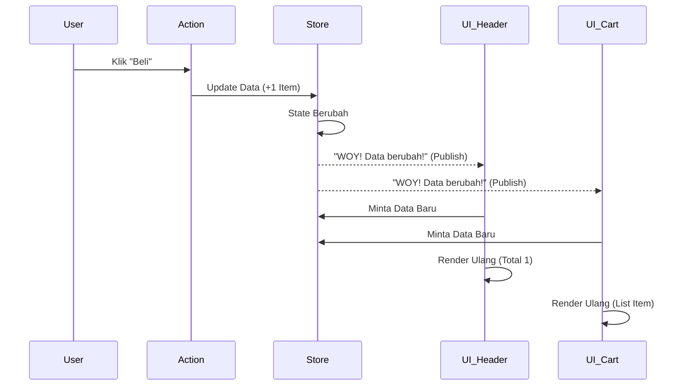

# HARI 3: Otak Cerdas (Store & State Management)

**Selamat Datang di Level Menengah!** 🧠

Di Hari 2, kita belajar "Ingatan Mati" (LocalStorage). Data tersimpan, tapi UI tidak tahu. Kita harus refresh browser baru datanya muncul. Itu tidak keren.
Di Modern Web App (React, Vue, dll), kita mengenal konsep **Reactive State**.
Jika data berubah, Tampilan (UI) harus update secara otomatis. Detik itu juga.

Hari ini, kita akan membuat sistem itu dari nol menggunakan Vanilla JS. Kita akan menerapkan pola **Observer Pattern** (atau sering disebut Pub/Sub) yang menjadi dasar dari Redux dan Context API.

**Target Utama Hari Ini:**
1.  **Architecture:** Memahami pola *Publisher/Subscriber*.
2.  **Concept:** Deep dive ke *Closure* dan *Encapsulation*.
3.  **Implementation:** Membangun `Store.js` yang reaktif tanpa framework.

---

## BAGIAN 1: 🔬 Anatomi Syntax (Fundamental Knowledge)

Ini adalah materi tersulit tapi PALING PENTING dalam karir JavaScript mu.
Baca pelan-pelan.

### 1. Closure (Data Private) 🔒
*Membungkus data agar tidak bisa disentuh sembarangan.*

*   **PROBLEM:** Variabel Global itu bahaya. Siapapun bisa mengubahnya.
    ```javascript
    let uang = 1000; // Global Variable
    // Orang jahat (atau developer ceroboh) bisa ubah seenaknya
    uang = -999999; 
    ```
*   **SOLUTION (Closure):**
    Kita masukkan variabel ke dalam fungsi. Variabel itu "terjebak" di dalam, hanya bisa diakses lewat pintu khusus.
    ```javascript
    function dompet() {
        let _uang = 1000; // Private (Pake underscore biar gaya)

        return {
            ambilUang: () => _uang, // Getter (Cuma bisa lihat)
            tambahUang: (n) => _uang += n // Setter (Pintu masuk terkontrol)
        };
    }
    
    const dompetKu = dompet();
    console.log(dompetKu._uang); // undefined (Gak bisa akses langsung!)
    console.log(dompetKu.ambilUang()); // 1000 (Lewat pintu resmi)
    ```

### 2. Pub/Sub Pattern (Penyiar & Pendengar) 📡
*Konsep dasar Notification System.*

*   **Publisher (Penyiar):** Store. Saat data berubah, dia berteriak.
*   **Subscriber (Pendengar):** Komponen UI. Mereka mendaftar untuk mendengarkan teriakan Store.

**Visualisasi Alur Pub/Sub:**



**Analogi:**
1.  UI A: "Store, kabari aku kalau stok berubah ya." (Subscribe).
2.  Store: (Diam).
3.  User: (Beli barang -> Stok berkurang).
4.  Store: "WOY SEMUANYA! stok BERUBAH JADI 99!" (Publish).
5.  UI A: "Oke makasih, aku update angka di layar."

### 3. High Order Function (HOF) 🏗️
Function yang mengembalikan function lain.
Fungsi `buatPenyimpananData` yang akan kita buat adalah HOF, karena dia mengembalikan object berisi function-function (`ambilData`, `aturData`).

---

## BAGIAN 2: 🧠 Under The Hood (Teori Mendalam)

### Memory Leak di Event Listeners ⚠️
Saat kita melakukan `subscribe`, kita menyimpan referensi fungsi ke dalam Array `daftarPendengar`.
Jika komponen UI dihapus tapi kita lupa `unsubscribe`, fungsi itu tetap hidup di memori (Zombie). Ini disebut **Memory Leak**.
Lama-lama browser jadi berat.

Itulah kenapa fungsi `subscribe` kita nanti akan mengembalikan fungsi `unsubscribe` (cleanup), mirip seperti `useEffect` di React.

---

## BAGIAN 3: 🏗️ Pembangunan Milestones

Kita akan membuat file `js/lib/Store.js`.
Kita namakan folder `lib` (Library) karena ini adalah kode inti yang bisa dipakai di proyek lain, bukan cuma POS.

### Milestone 1: Kerangka Factory Function (`js/lib/Store.js`)

Jangan gunakan Class (karena kita ingin pakai pendekatan Functional yang lebih modern dan aman dari `this` binding).

**Buat file `js/lib/Store.js`:**

```javascript
/**
 * LIB: STORE (MANAJEMEN DATA REAKTIF)
 * 
 * Ini adalah "Otak" aplikasi.
 * Tugasnya:
 * 1. Meyimpan data (State) secara privat.
 * 2. Mengizinkan orang lain "Mendengarkan" perubahan (Subscribe).
 * 3. Memberitahu semua pendengar saat data berubah.
 */

export function buatPenyimpananData(dataAwal = {}) {
    // 1. STATE PRIVATE (Closure)
    // Tidak bisa diakses langsung dari console (`store.data` -> undefined)
    let state = dataAwal;
    
    // 2. DAFTAR PENDENGAR (Subscribers)
    // Array berisi fungsi-fungsi yang minta dikabari
    // Contoh isi: [ renderKeranjang, updateHeader, console.log ]
    let daftarPendengar = [];

    // --- METHODS ---

    /** A. Getter (Mengintip Data) */
    function ambilData() {
        return state; // Kembalikan object data apa adanya
    }

    /** B. Subscribe (Mendaftar) */
    function dengarkanPerubahan(fungsiPendengar) {
        // Masukkan fungsi baru ke daftar antrian
        daftarPendengar.push(fungsiPendengar);
        
        // Return fungsi Unsubscribe (untuk bersih-bersih/berhenti langganan)
        // Ini pola standar di React (useEffect cleanup)
        return () => {
             // Hapus fungsiPendengar dari array
             daftarPendengar = daftarPendengar.filter(f => f !== fungsiPendengar);
        };
    }

    /** C. Setter (Mengubah Data & Teriak) */
    function aturData(dataBaru) {
        // Update state lama dengan yang baru (Merge object)
        // ...state = data lama
        // ...dataBaru = data update (menimpa yang lama)
        state = { ...state, ...dataBaru };
        
        // LOOP & BERITAHU SEMUA PENDENGAR
        // "Woy data berubah nih! Ini data barunya."
        daftarPendengar.forEach(fungsi => {
            fungsi(state); 
        });
    }

    // Kembalikan Remote Control (Public API)
    return {
        ambilData,
        dengarkanPerubahan,
        aturData
    };
}
```

### Milestone 2: Uji Coba Store (Simulasi)

Sebelum kita pakai di POS, kita tes dulu "Otak" baru ini di `main.js`.
Apakah dia benar-benar reaktif?

**Modifikasi `js/main.js` sementara:**

```javascript
/* TEST STORE AREA */
import { buatPenyimpananData } from './lib/Store.js';
import { buatElemen } from './utils/index.js';

// 1. Bikin Store
const toko = buatPenyimpananData({ saldo: 5000 });

// 2. Bikin UI Dummy
const app = document.getElementById('aplikasi');
app.innerHTML = ''; // Bersihkan layar

const labelSaldo = buatElemen('h1', {}, `Saldo: ${toko.ambilData().saldo}`);
const tombolTambah = buatElemen('button', {
    style: 'padding: 10px; font-size: 20px;',
    onClick: () => {
        // LOGIC UPDATE:
        const dataLama = toko.ambilData();
        // Update Store (+1000)
        toko.aturData({ saldo: dataLama.saldo + 1000 });
        // Perhatikan: Kita TIDAK update textContent manual di sini!
    }
}, 'Tambah 1000');

app.appendChild(labelSaldo);
app.appendChild(tombolTambah);

// 3. THE MAGIC (Subscribe)
// "Toko, kalau ada perubahan, tolong jalankan fungsi ini ya"
toko.dengarkanPerubahan((stateBaru) => {
    console.log("State berubah jadi:", stateBaru);
    // UI Update otomatis di sini!
    labelSaldo.textContent = `Saldo: ${stateBaru.saldo}`;
});

/* END TEST STORE AREA */
```

**Hasil:**
Klik tombol "Tambah 1000".
Jika angka di layar berubah TANPA kita menyentuh `labelSaldo.textContent` di dalam `onClick`, berarti Store Reaktif sudah berhasil!
`onClick` hanya mengubah Data. Data mengubah UI. Inilah **Data Driven UI**.

---

### Milestone 3: Integrasi dengan Database (Penting!)

Store kita sekarang "Lupa Ingatan" kalau di-refresh (karena cuma di memori variabel RAM).
Di React biasanya kita gabungkan Store dengan Effect untuk simpan ke LocalStorage.

Di proyek POS Lite ini, kita akan menggunakan:
1.  **LocalStorage (js/db/core.js):** Untuk data Master (Produk, User, Transaksi) yang harus awet selamanya.
2.  **Store (js/lib/Store.js):** Untuk data Sementara (Keranjang Belanja, UI State) yang butuh kecepatan tinggi dan update real-time.

Jadi biarkan `Store.js` murni di memori saja (RAM) untuk saat ini. Nanti di fitur Keranjang (Hari 8), kita akan pakai Store ini habis-habisan.

---

## BAGIAN 4: 🛠️ Troubleshooting (Masalah Umum)

| Masalah | Penyebab | Solusi |
| :--- | :--- | :--- |
| UI tidak berubah walau tombol diklik | Lupa memanggil `dengarkanPerubahan`. | Pastikan ada kode `store.dengarkanPerubahan(...)` yang melakukan update DOM. |
| Error `aturData is not a function` | Salah return di `buatPenyimpananData`. | Cek apakah fungsi `aturData` sudah masuk dalam object return. |
| State berubah tapi data lama hilang | Lupa spread operator `...state`. | Di `aturData`, pastikan pakai `{ ...state, ...dataBaru }`. Kalau cuma `state = dataBaru`, property lain akan hilang. |
| Infinite Loop (Browser Hang) | Mengupdate state DI DALAM listener sendiri. | Jangan panggil `aturData` di dalam fungsi yang sedang `dengarkanPerubahan`. Itu akan memicu update berantai tanpa henti. |

---

## BAGIAN 5: 💪 Tugas Pembiasaan (Level Up)

### Tugas 1: The Logger 📝
1.  Di `main.js`, tambahkan Subscriber kedua.
2.  Tugasnya cuma satu: `console.log("LOG CATATAN:", stateBaru)`.
3.  Sekarang saat tombol diklik, harus ada 2 kejadian: Angka berubah, DAN log muncul.
    Ini membuktikan 1 Event bisa mentrigger BANYAK listener (One-to-Many).

### Tugas 2: Unsubscribe Button 🔕
1.  Ingat `dengarkanPerubahan` mengembalikan fungsi cleanup? Simpan dalam variabel.
    `const stop = toko.dengarkanPerubahan(...)`
2.  Buat tombol baru "Stop Update".
3.  Jika diklik, panggil `stop()`.
4.  Coba klik "Tambah 1000" lagi. Angka di layar HARUSNYA DIAM (karena sudah unsubscribe), tapi saldo di dalam memori tetap nambah (cek console manual).

---

**Evaluasi Hari 3:**
Jika kamu paham bedanya `toko.ambilData()` (sekali intip) dengan `toko.dengarkanPerubahan()` (langganan update), kamu sudah menguasai konsep dasar State Management modern.

*Sampai jumpa di Hari 4! Kita akan menerapkan ini untuk fitur Login & User Session. 👮‍♂️*
