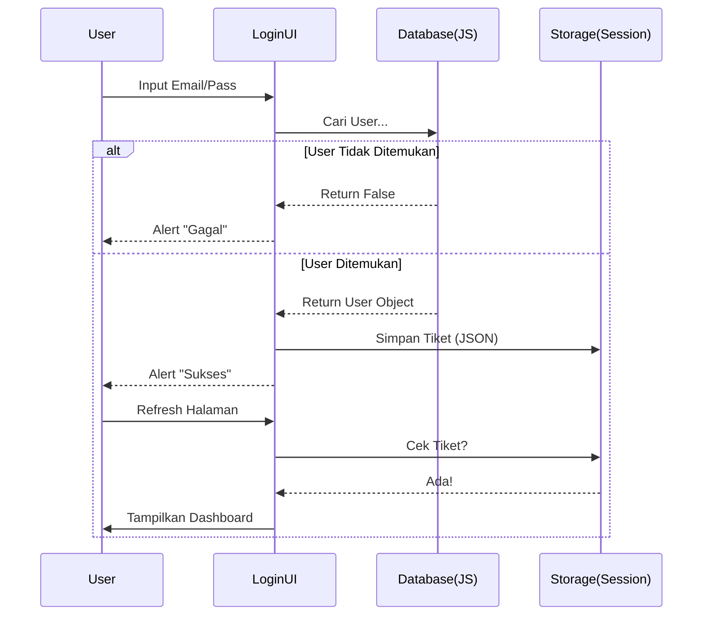

# HARI 4: Sang Penjaga Gerbang (Authentication)

**Security Check!** 👮‍♂️

Aplikasi POS tidak boleh dipakai sembarang orang. Kita butuh sistem **Login**.
Hari ini kita akan menggabungkan ilmu Database (Hari 2) dan Event Handling untuk membuat fitur Autentikasi sederhana.

Ini adalah simulasi, tapi logikanya 90% sama dengan aplikasi profesional yang pakai backend server.

**Target Utama Hari Ini:**
1.  **Logic:** Memahami alur *Protected Route*.
2.  **Security:** Menyimpan Session dengan aman (simulasi).
3.  **UI:** Membuat halaman Login/Register yang fungsional.

---

## BAGIAN 1: 🔬 Anatomi Syntax (Fundamental Knowledge)

### 1. Logical Operators Traps 🚦
*Simbol pembuat keputusan.*

*   **AND (`&&`):** KEDUANYA harus benar.
    ```javascript
    const emailAda = true;
    const passwordCocok = true;
    if (emailAda && passwordCocok) { /* Login Sukses */ }
    ```
*   **OR (`||`):** SALAH SATU benar cukup.
    *   Sering dipakai untuk **Default Value**.
    ```javascript
    const namaUser = inputNama || "Tanpa Nama";
    // Jika inputNama kosong (false/null), pakai "Tanpa Nama".
    ```
*   **NOT (`!`):** Kebalikan.
    ```javascript
    if (!user) { /* Jika user TIDAK ada */ }
    ```

### 2. Session Management 🎫
*Tiket masuk wahana.*

*   **Logic:**
    1.  User kirim Username & Password.
    2.  Sistem cek di Database.
    3.  Jika cocok, Sistem kasih "Tiket" (Session ID).
    4.  User simpan tiket itu.
    5.  Setiap kali User buka halaman lain, User tunjukin tiketnya.

**Visualisasi Alur Auth:**



### 3. Module Pattern: Barrel Exports 🛢️
Kita akan membuat folder `js/auth/` yang isinya banyak file (`login.js`, `register.js`, `session.js`). Agar rapi, kita akan mengekspos semuanya lewat `index.js`, teknik yang sama dengan `js/utils/`.

---

## BAGIAN 2: 🧠 Under The Hood (Teori Mendalam)

### Di mana menyimpan Token Login? 🛡️

Ada 3 tempat populer untuk menyimpan status login di browser:

1.  **LocalStorage:**
    *   *Pro:* Paling gampang, data awet.
    *   *Con:* Rawan XSS (Script jahat bisa baca `localStorage.getItem` dan nyuri token).
    *   *Our Choice:* Kita pakai ini karena aplikasi kita offline dan tidak ada server beneran. Aman untuk belajar.
2.  **SessionStorage:**
    *   *Pro:* Hilang otomatis saat Tab ditutup. Lebih aman dikit.
    *   *Con:* User harus login ulang tiap buka tab baru.
3.  **HttpOnly Cookie:**
    *   *Pro:* Paling Aman (JS tidak bisa baca). Standar Industri.
    *   *Con:* Butuh Backend Server asli untuk setting cookie. Kita belum punya.

---

## BAGIAN 3: 🏗️ Pembangunan Milestones

Kita akan membuat 'Departemen Keamanan' di dalam folder `js/auth`.

### Milestone 1: Manajemen User Database (`js/db/users.js`)

Kita butuh tempat untuk menyimpan daftar user dan mencatat session. Update folder DB.

**Buat file `js/db/users.js`:**

```javascript
import { ambilStatePOS, simpanStatePOS, KUNCI_PENYIMPANAN } from './core.js';

/**
 * Mencari user berdasarkan email.
 * Digunakan saat Login untuk mengecek apakah email terdaftar.
 */
export function cariPenggunaByEmail(email) {
    const state = ambilStatePOS();
    const users = state.pengguna || [];
    // .find() mengembalikan object user pertama yang cocok, atau undefined
    return users.find(u => u.email === email);
}

/**
 * Mendaftarkan user baru (Register).
 */
export function tambahPengguna(userBaru) {
    const state = ambilStatePOS();
    
    if (!state.pengguna) state.pengguna = []; // Inisialisasi jika array belum ada
    
    // Cek duplikat (Safety)
    const ada = state.pengguna.find(u => u.email === userBaru.email);
    if (ada) {
        throw new Error("Email sudah terdaftar!");
    }

    state.pengguna.push(userBaru);
    simpanStatePOS(state);
}

/**
 * SESSION: Menyimpan siapa yang sedang login di kunci terpisah.
 * Ini agar walau state di-reset, session tetap aman (opsional), 
 * atau agar mudah diakses tanpa bongkar state besar.
 */
export function setPenggunaSaatIni(user) {
    // Simpan object user ke LocalStorage khusus session
    localStorage.setItem(KUNCI_PENYIMPANAN.PENGGUNA_SAAT_INI, JSON.stringify(user));
}

export function ambilPenggunaSaatIni() {
    const json = localStorage.getItem(KUNCI_PENYIMPANAN.PENGGUNA_SAAT_INI);
    try {
        return json ? JSON.parse(json) : null;
    } catch (e) {
        return null;
    }
}

export function hapusSesi() {
    localStorage.removeItem(KUNCI_PENYIMPANAN.PENGGUNA_SAAT_INI);
}
```

Jangan lupa export file ini di `js/db/index.js`:
`export * from './users.js';`

---

### Milestone 2: Logic Login (`js/auth/login.js`)

Kita pisahkan tampilan (UI rendering) dan logic.

**Buat file `js/auth/login.js`:**

```javascript
import { cariPenggunaByEmail, setPenggunaSaatIni } from '../db/users.js';
import { buatElemen, tampilkanNotifikasi } from '../utils/index.js'; // Asumsi notification ada di utils (Day 11 nanti kita rapikan, skrg pakai alert dulu gpp)

/**
 * Merender Elemen Form Login
 */
export function renderHalamanLogin() {
    return buatElemen('div', { className: 'auth-container', style: 'max-width: 400px; margin: 50px auto; padding: 20px; border: 1px solid #ccc; border-radius: 8px;' },
        buatElemen('h2', { className: 'text-center' }, 'Login POS Lite'),
        
        buatElemen('form', { onSubmit: prosesLogin },
            // Input Email
            buatElemen('div', { className: 'form-group' },
                buatElemen('label', {}, 'Email'),
                buatElemen('input', { type: 'email', name: 'email', id: 'login-email', required: true, className: 'form-input', style: 'width: 100%; padding: 8px; margin-bottom: 10px;' })
            ),
            
            // Input Password
            buatElemen('div', { className: 'form-group' },
                buatElemen('label', {}, 'Password'),
                buatElemen('input', { type: 'password', name: 'password', id: 'login-password', required: true, className: 'form-input', style: 'width: 100%; padding: 8px; margin-bottom: 20px;' })
            ),
            
            // Tombol Login
            buatElemen('button', { type: 'submit', className: 'btn-primary', style: 'width: 100%; padding: 10px; background: #007bff; color: white; border: none; border-radius: 4px; cursor: pointer;' }, 'Masuk')
        ),
        
        // Link Register (Nanti di milestone berikutnya)
        buatElemen('p', { className: 'text-center', style: 'margin-top: 15px;' }, 
            "Belum punya akun? ",
            buatElemen('a', { href: '#', id: 'link-ke-register' }, 'Daftar di sini')
        )
    );
}

/**
 * Handle Submit Form Login
 */
function prosesLogin(e) {
    e.preventDefault(); // Stop Refresh halaman!
    
    const email = document.getElementById('login-email').value;
    const password = document.getElementById('login-password').value;

    // 1. Cari User di DB
    const user = cariPenggunaByEmail(email);

    // 2. Validasi
    if (!user) {
        alert("Email tidak ditemukan!");
        return;
    }

    if (user.password !== password) {
        alert("Password salah!");
        return;
    }

    // 3. Sukses Login
    console.log("Login Sukzes:", user.nama);
    setPenggunaSaatIni(user); // Simpan session
    
    alert(`Selamat datag, ${user.nama}!`);
    window.location.reload(); // Refresh halaman agar masuk ke Dashboard
}
```

---

### Milestone 3: Integrasi dengan Main (`js/main.js`)

Sekarang `main.js` bertugas sebagai "Satpam".
Logic:
- Cek Session.
- Jika ADA -> Tampilkan Dashboard.
- Jika TIDAK ADA -> Tampilkan Halaman Login.

**Update `js/main.js`:**

```javascript
import { ambilPenggunaSaatIni, hapusSesi } from './db/users.js';
import { renderHalamanLogin } from './auth/login.js';
// ... import lainnya ...

const app = document.getElementById('aplikasi');
app.innerHTML = ''; // Bersihkan

// 1. Cek Siapa yang Login?
const userAktif = ambilPenggunaSaatIni();

if (!userAktif) {
    // --- MODE TAMU (Belum Login) ---
    console.log("User belum login. Menampilkan form login.");
    app.appendChild(renderHalamanLogin());
    
    // (Opsional) Pasang event listener buat link register nanti
} else {
    // --- MODE MEMBER (Sudah Login) ---
    console.log(`User login: ${userAktif.nama}`);
    
    // Header Selamat Datang
    app.appendChild(buatElemen('div', { style: 'display: flex; justify-content: space-between; align-items: center; padding: 20px; background: #f8f9fa;' }, 
        buatElemen('h2', {}, `Halo, ${userAktif.nama} 👋`),
        buatElemen('button', {
            style: 'background: red; color: white; border: none; padding: 8px 16px; cursor: pointer;',
            onClick: () => {
                // LOGOUT LOGIC
                if(confirm("Yakin mau logout?")) {
                    hapusSesi();
                    window.location.reload();
                }
            }
        }, 'Logout')
    ));

    // Konten Dashboard (Sementara teks dulu)
    app.appendChild(buatElemen('div', { style: 'padding: 20px;' }, "Ini adalah Halaman Dashboard POS."));
}
```

---

## BAGIAN 4: 🛠️ Troubleshooting (Masalah Umum)

| Masalah | Penyebab | Solusi |
| :--- | :--- | :--- |
| Login berhasil tapi balik ke form login setelah reload | LocalStorage session tidak tersimpan. | Cek fungsi `setPenggunaSaatIni`. Pastikan `localStorage.setItem` dijalankan. |
| Tombol Logout tidak muncul | userAktif bernilai `null`. | Pastikan setelah login, browser direload agar logic `if (userAktif)` di jalankan ulang. |
| Error `email` of undefined | Database `pos_state` belum punya array `pengguna`. | Jalankan kode seeder atau reset database. |

---

## BAGIAN 5: 💪 Tugas Pembiasaan (Level Up)

### Tugas 1: Auto Admin (Untuk Developer Malas) 🤖
Capek register manual tiap reset DB?
Di `main.js`, sebelum cek session, tambahkan logic:
"Jika DB User kosong, buatkan user 'admin@test.com' dengan password '123' secara otomatis."
Gunakan fungsi `tambahPengguna` dari db.

### Tugas 2: Register Form 📝
1.  Buat file `js/auth/register.js`.
2.  Desain formnya (Nama, Email, Password).
3.  Logic submit: Panggil `tambahPengguna`. Jika sukses, panggil `renderHalamanLogin` ulang (atau reload).
4.  Hubungkan link "Daftar di sini" di module login agar merender module register ini. Ini adalah latihan switching UI tanpa reload sederhana.

---

**Evaluasi Hari 4:**
Jika kamu bisa Login, melihat nama user di header, lalu Logout dan kembali ke form Login, SELAMAT!
Kamu sudah membuat *Protected Route* sederhana.

Besok (Hari 5), kita akan mengisi Dashboard kosong itu dengan UI Layout yang kompleks (Sidebar, Tabs). 🗺️

*Sampai jumpa di Hari 5!*
