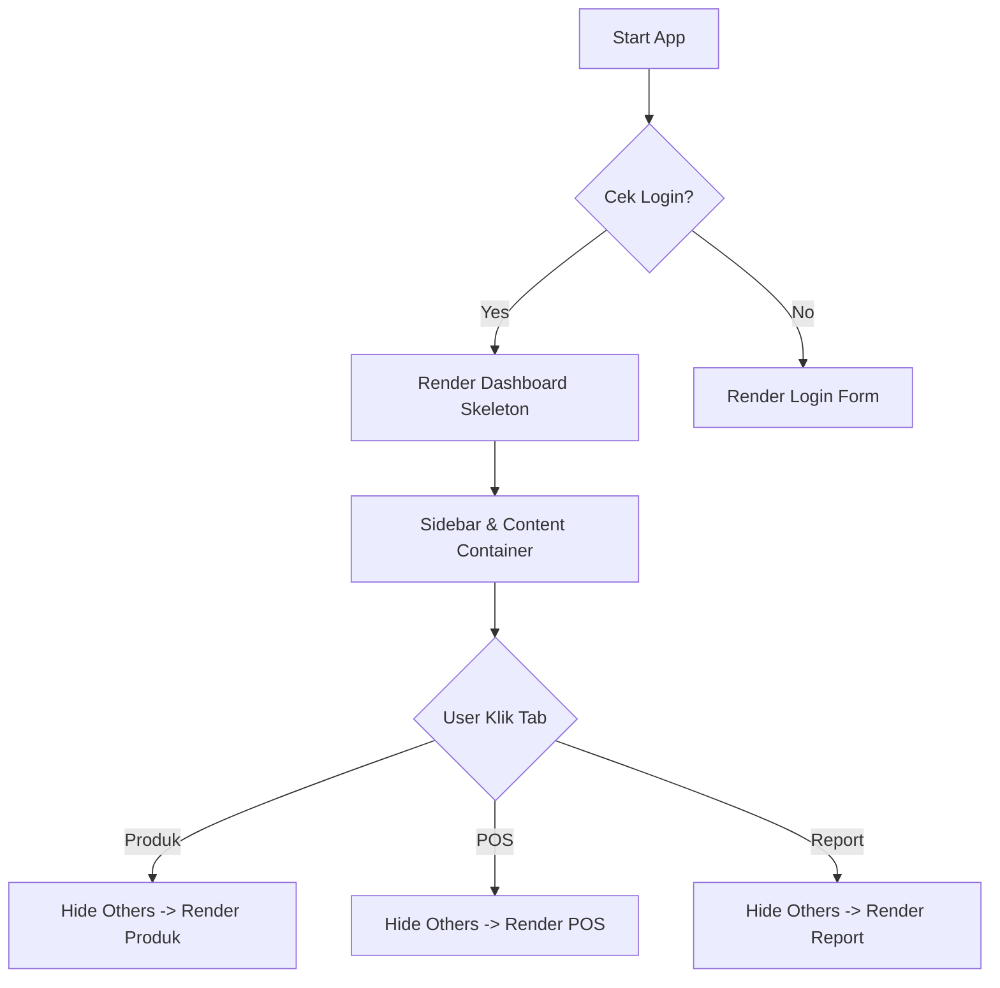

# HARI 5: Penata Panggung (SPA Architecture & Layout)

**Selamat Datang di Level Arsitek!** 🏗️

Sampai Hari 4, aplikasi kita cuma bisa Login dan melihat layar putih kosong "Dashboard".
Hari ini kita akan membangun **Rumah** sesungguhnya.

Kita akan menerapkan konsep **SPA (Single Page Application)**.
Sebuah pendekatan modern di mana kita memanipulasi DOM untuk menukar konten secara instan, memberikan pengalaman seperti aplikasi Native (Desktop/Mobile).

**Target Utama Hari Ini:**
1.  **Architecture:** Memahami siklus hidup SPA.
2.  **Performance:** Belajar Event Delegation untuk menghemat memori.
3.  **UI:** Membangun Sidebar Navigasi dan Tabs.

---

## BAGIAN 1: 🔬 Anatomi Syntax (Fundamental Knowledge)

### 1. SPA Mechanism (Ilusi Optik) 🎭
*Bagaimana cara ganti halaman tanpa ganti file HTML?*

*   **TRADISIONAL (Multi Page):**
    *   Klik `kontrol.html` -> Browser request server -> Layar putih -> Download HTML baru -> Render ulang semuanya.
*   **SPA (Single Page):**
    *   Klik `Kontrol` -> JS hapus konten lama -> JS bikin konten baru -> Tempel. (0 detik, tanpa layar putih).

**Visualisasi SPA Lifecycle:**



### 2. Event Delegation 👂
*Jangan pasang telinga di setiap pintu. Pasang satu mikrofon di lorong.*

*   **PROBLEM:** Misal kamu punya 100 tombol delete di tabel.
    *   **Cara Pemula:** Loop 100 kali, pasang `addEventListener` ke setiap tombol. (Boros Memori!).
*   **SOLUTION:** Pasang 1 event listener di **BAPAKNYA** (Parent Element).
    *   Saat tombol diklik, event itu akan "menggelembung" (Bubble Up) ke Bapaknya.
    *   Si Bapak cek: "Eh, tadi yang diklik anak yang mana?" (`e.target`).

**Code Example:**
```javascript
const bapak = document.getElementById('container-tombol');

bapak.addEventListener('click', (e) => {
    // e.target adalah elemen yang diklik langsung
    // .closest() mencari bapak/dirinya sendiri yang punya class tertentu (aman kalau user klik icon di dalam tombol)
    const tombolDelete = e.target.closest('.btn-delete');
    
    if (tombolDelete) {
        console.log("Hapus barang ID:", tombolDelete.dataset.id);
    }
});
```

### 3. classList API 🛠️
*Tukang Ganti Baju Elemen.*

*   `element.classList.add('active')`: Pakai baju (Muncul).
*   `element.classList.remove('active')`: Lepas baju (Hilang).
*   `element.classList.toggle('active')`: Kalau pakai dilepas, kalau lepas dipakai (Saklar).
*   `element.classList.contains('active')`: Apakah sedang pakai baju ini? (Cek).

---

## BAGIAN 2: 🧠 Under The Hood (Teori Mendalam)

### Reflow & Repaint (Kinerja Browser) 🎨
Saat kita mengubah DOM (misal `div.style.display = 'block'`), browser harus bekerja keras:

1.  **Recalculate Style:** Hitung ulang CSS.
2.  **Reflow (Layout):** Hitung ulang posisi geometri (koordinat X, Y) setiap elemen karena ada elemen baru yang muncul dan mendorong elemen lain.
3.  **Repaint:** Menggambar ulang pixel warna ke layar.

*SPA yang buruk* membuat browser melakukan Reflow berkali-kali dalam 1 detik (Laggy).
*SPA yang baik* melakukan update DOM sekaligus (Batching) untuk meminimalisir Reflow.
Inilah kenapa kita menggunakan `innerHTML` string panjang atau `documentFragment` di React, daripada `append` satu-satu ratusan kali.

---

## BAGIAN 3: 🏗️ Pembangunan Milestones

### Milestone 0: Bersih-bersih `main.js` (Reset) 🧹

Di Hari 1-4, `js/main.js` kita penuh dengan kode eksperimen (tes kartu produk, tes login log).
Sekarang saatnya bersih-bersih agar menjadi **Pusat Kontrol Profesional**.

**Buka `js/main.js`, HAPUS SEMUA kodenya, ganti dengan kerangka bersih ini:**

```javascript
/**
 * MAIN.JS - Pintu Masuk Aplikasi
 */
import { ambilPenggunaSaatIni, hapusSesi } from './db/users.js';
import { renderHalamanLogin } from './auth/login.js';
import * as Utilitas from './utils/index.js';

// Import Layout (Nanti kita buat filenya)
import { inisialisasiNavigasi } from './layout.js';

// 1. Siapkan Wadah
const app = document.getElementById('aplikasi');

// 2. LOGIC STARTUP
function mulaiAplikasi() {
    app.innerHTML = ''; // Reset layar

    const user = ambilPenggunaSaatIni();

    if (!user) {
        // A. BELUM LOGIN
        app.appendChild(renderHalamanLogin());
    } else {
        // B. SUDAH LOGIN -> Masuk Dashboard
        renderDashboardUtama(user);
    }
}

function renderDashboardUtama(user) {
    // Render Struktur Layout SPA (Sidebar/Nav + Content Area)
    // Kita akan buat helper renderLayout di layout.js sebentar lagi
    // Untuk sekarang kita tulis HTML string dulu biar cepat, nanti direfactor
    app.innerHTML = `
        <header class="app-header">
            <h1>POS Lite 🚀</h1>
            <div class="user-info">
                <span>Halo, <b>${user.nama}</b></span>
                <button id="btn-logout" class="btn-danger">Logout</button>
            </div>
        </header>

        <nav class="app-nav">
            <button class="tab-btn active" data-target="overview">Overview</button>
            <button class="tab-btn" data-target="products">Produk</button>
            <button class="tab-btn" data-target="pos">Kasir (POS)</button>
            <button class="tab-btn" data-target="reports">Laporan</button>
        </nav>

        <main class="app-content">
            <!-- SEKSI 1: OVERVIEW -->
            <section id="section-overview" class="content-section active">
                <h2>Ringkasan Toko</h2>
                <p>Selamat datang di sistem kasir.</p>
                <div class="stats-grid">
                    <div class="card">Total Produk: <span id="stat-produk">0</span></div>
                    <div class="card">Omzet Hari Ini: <span id="stat-omzet">Rp 0</span></div>
                </div>
            </section>

            <!-- SEKSI 2: PRODUK -->
            <section id="section-products" class="content-section">
                <h2>Manajemen Produk</h2>
                <div id="produk-container"></div> 
            </section>

            <!-- SEKSI 3: POS -->
            <section id="section-pos" class="content-section">
                <h2>Point of Sale</h2>
                <div id="pos-container"></div>
            </section>

            <!-- SEKSI 4: REPORTS -->
            <section id="section-reports" class="content-section">
                <h2>Laporan Transaksi</h2>
                <div id="laporan-container"></div>
            </section>
        </main>
    `;

    // Pasang Event Listener Logout
    document.getElementById('btn-logout').addEventListener('click', () => {
        if(confirm("Keluar aplikasi?")) {
            hapusSesi();
            mulaiAplikasi(); // Reload ke login
        }
    });

    // JALANKAN NAVIGASI (Milestone berikutnya)
    inisialisasiNavigasi();
}

// Start!
mulaiAplikasi();
```

---

### Milestone 1: Module Layout (`js/layout.js`)

Kita butuh otak untuk mengatur perpindahan tab.

**Buat file `js/layout.js`:**

```javascript
/* JS/LAYOUT.JS - Pengatur Navigasi */

// Kita import module halaman lain (walau belum dibuat, siapkan saja importnya)
// import { renderTabelProduk } from './products/index.js'; (Nanti Day 6)
// import { initPOS } from './pos/index.js'; (Nanti Day 8)
// Import ini nanti akan kita aktifkan satu-satu di hari berikutnya.

export function inisialisasiNavigasi() {
    // 1. Ambil semua elemen penting
    const semuaTombol = document.querySelectorAll('.tab-btn');
    const semuaSeksi = document.querySelectorAll('.content-section');

    // 2. Pasang Event Listener di setiap tombol
    semuaTombol.forEach(tombol => {
        tombol.addEventListener('click', () => {
            const targetId = tombol.dataset.target; // ambil data-target="..."

            // A. Matikan semua yang aktif (Reset)
            semuaTombol.forEach(btn => btn.classList.remove('active'));
            semuaSeksi.forEach(section => section.classList.remove('active'));

            // B. Aktifkan yang diklik
            tombol.classList.add('active'); // Tombol jadi tebal
            
            const seksiTujuan = document.getElementById(`section-${targetId}`);
            if (seksiTujuan) {
                seksiTujuan.classList.add('active'); // Halaman muncul
            }

            // C. LAZY LOAD (Muat Data Hanya Saat Dibuka)
            // Ini agar aplikasi ringan. Jangan muat semua di awal.
            if (targetId === 'products') {
                console.log("Memuat data produk...");
                // renderTabelProduk(); // (Akan kita buka komennya di Hari 6)
            } else if (targetId === 'pos') {
                console.log("Menyiapkan mesin kasir...");
                // initPOS(); // (Akan kita buka komennya di Hari 8)
            }
        });
    });
}
```

---

### Milestone 2: Styling Layout (`styles.css`)

Tanpa CSS, konsep SPA ini gagal total (semua section akan tampil menumpuk ke bawah).
Kita harus menyembunyikan section yang tidak aktif.

**Buka `styles.css`, Tambahkan/Ganti dengan ini:**

```css
/* --- LAYOUT UTAMA --- */
.app-header {
    background: #333;
    color: white;
    padding: 1rem;
    display: flex;
    justify-content: space-between;
    align-items: center;
}

.app-nav {
    background: #eee;
    padding: 10px;
    border-bottom: 2px solid #ddd;
    display: flex;
    gap: 10px;
}

.tab-btn {
    padding: 10px 20px;
    background: none;
    border: none;
    cursor: pointer;
    font-size: 16px;
    border-bottom: 3px solid transparent; /* Garis bawah transparan */
    transition: 0.3s;
}

.tab-btn:hover {
    background: #ddd;
}

/* TOMBOL AKTIF (Ada garis bawah warna biru) */
.tab-btn.active {
    border-bottom: 3px solid #007bff;
    font-weight: bold;
    color: #007bff;
}

.app-content {
    padding: 20px;
}

/* --- LOGIC SPA (PENTING!) --- */
.content-section {
    display: none; /* Default: Sembunyi */
    animation: fadeIn 0.3s; /* Efek muncul pelan */
}

.content-section.active {
    display: block; /* Munculkan jika ada class active */
}

@keyframes fadeIn {
    from { opacity: 0; transform: translateY(10px); }
    to { opacity: 1; transform: translateY(0); }
}

.btn-danger {
    background: #dc3545;
    color: white;
    border: none;
    padding: 8px 12px;
    border-radius: 4px;
    cursor: pointer;
}
```

---

## BAGIAN 4: 🛠️ Troubleshooting (Masalah Umum)

| Masalah | Penyebab | Solusi |
| :--- | :--- | :--- |
| Tombol diklik tapi konten tidak berubah | ID di HTML (`section-xyz`) beda dengan `data-target` di tombol. | Cek Typo. Jika `data-target="produk"`, maka ID harus `section-produk`. |
| Semua konten menumpuk | Lupa import file `styles.css` atau lupa rule `display: none`. | Pastikan `.content-section` punya `display: none` di CSS. |
| Klik tombol tidak ada efek sama sekali | `inisialisasiNavigasi()` belum dipanggil di `main.js`. | Pastikan fungsi init dipanggil SETELAH `app.innerHTML` dirender. |

---

## BAGIAN 5: 💪 Tugas Pembiasaan (Level Up)

### Tugas 1: The Default Tab 📍
Saat ini kalau di-refresh, halaman kembali ke Overview.
Coba ubah kode di `layout.js` agar kita bisa mengatur tab default.
Misal: Tambah parameter `inisialisasiNavigasi(defaultTab = 'overview')`.

### Tugas 2: Sticky Navbar 📌
Ubah CSS `.app-nav` menjadi `position: sticky; top: 0;`.
Scroll ke bawah (isi konten panjang dulu).
Pastikan menu navigasi tetap nempel di atas layar tidak ikut tergulung.

---

**Evaluasi Hari 5:**
Klik tombol-tombol navigasi.
Apakah konten di bawahnya berganti tanpa reload halaman?
Apakah tombol yang aktif warnanya beda?
Jika ya, Selamat! Kamu sudah membangun kerangka rumah SPA yang kokoh.

Besok (Hari 6), kita akan mulai mengisi Kamar Kosong pertama: **Halaman Produk** dengan data dari Database. 📦

*Sampai jumpa di Hari 6!*
