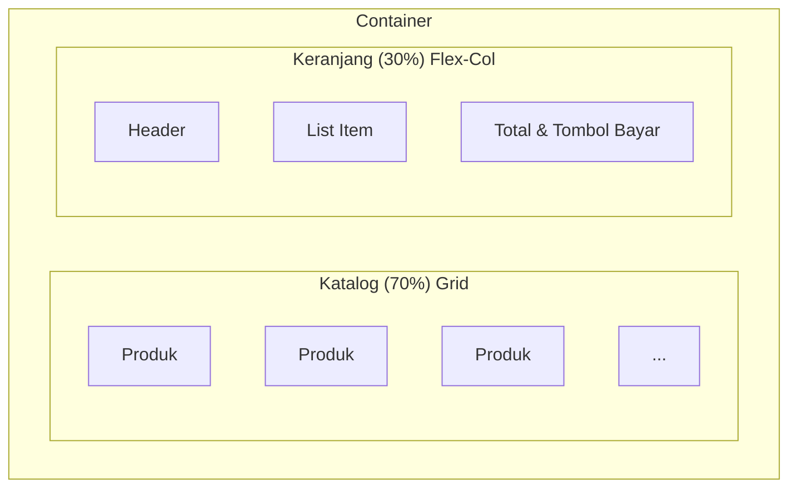

# HARI 8: Medan Perang (POS Interface & Cart)

**Selamat Datang di Kasir!** 🛒

Inilah fitur inti dari aplikasi POS.
Katalog Produk di kiri, Keranjang Belanja di kanan.
Tantangan terbesar di sini adalah **State Management** yang cepat.
Setiap kali tombol "Beli" diklik, keranjang harus update, total harga harus hitung ulang, UI harus render ulang. Semua dalam hitungan milidetik.

**Target Utama Hari Ini:**
1.  **Layout:** CSS Grid untuk Katalog Produk yang responsif.
2.  **Logic:** Mengelola `State Keranjang` (Tambah, Kurang, Hapus).
3.  **Component:** Membuat kartu produk yang reusable.

---

## BAGIAN 1: 🔬 Anatomi Syntax (Fundamental Knowledge)

### 1. CSS Grid: `minmax` + `auto-fill` 📐
*Layout Responsif Otomatis Tanpa Pusing.*

*   **PROBLEM:** Flexbox bagus untuk 1 baris. Tapi untuk kotak-kotak banyak yang harus turun baris rapi? Ribet.
*   **SOLUTION:** Grid Power.
    ```css
    .grid {
        display: grid;
        grid-template-columns: repeat(auto-fill, minmax(150px, 1fr));
        gap: 10px;
    }
    ```
    *   `minmax(150px, 1fr)`: Lebar kartu minimal 150px. Kalau ada sisa ruang, melar (1fr).
    *   `auto-fill`: Isi kolom sebanyak mungkin sampai mentok layar, baru turun baris.
    *   **Hasil:** Di HP jadi 2 kolom, di Laptop jadi 5 kolom. OTOMATIS.

**Visualisasi Layout POS:**



### 2. Derived State (Data Turunan) 🧮
*Hitung, jangan simpan.*

*   **KONSEP:** Jangan simpan `totalHarga` di database. Simpanlah `items`-nya saja. `totalHarga` adalah hasil matematika dari `items`.
*   **WHY:** Kalau kamu simpan `totalHarga = 5000`, lalu ada 1 item dihapus tapi kamu lupa update `totalHarga`, maka data jadi kacau (Bug).
*   **BEST PRACTICE:** Hitung `total` secara *on-the-fly* setiap kali render.
    `const total = items.reduce((acc, item) => acc + (item.price * item.qty), 0);`

---

## BAGIAN 2: 🧠 Under The Hood (Teori Mendalam)

### Local State vs Global State 🌐

*   **Global State (Database):** Data Produk, Data User. (Harus awet).
*   **Local State (POS):** Keranjang Belanja. (Sementara).
    Apakah Keranjang perlu disimpan ke Database selamanya?
    Tidak harus. Kalau user refresh, keranjang hilang tidak masalah (kecuali fitur "Simpan Keranjang").
    Maka kita gunakan **Variable JavaScript biasa** atau `Store` (Hari 3) untuk kecepatan maksimal, tanpa `localStorage` yang lambat.

---

## BAGIAN 3: 🏗️ Pembangunan Milestones

Kita bekerja di folder `js/pos/`. Buat `js/pos/index.js`.

### Milestone 1: Layout Split Screen (`js/pos/index.js`)

```javascript
import { buatElemen, formatKeRupiah } from '../utils/index.js';
import * as Penyimpanan from '../db/index.js';
import { buatPenyimpananData } from '../lib/Store.js'; // Store Hari 3

// --- STATE LOKAL KERANJANG ---
// Kita pakai Store Reaktif biar UI update otomatis!
const keranjangStore = buatPenyimpananData({
    items: [], // Array of { id, nama, harga, qty, stokMax }
    total: 0
});

export function initPOS() {
    const container = document.getElementById('pos-container');
    if (!container) return;

    container.innerHTML = '';
    
    // Layout Flex (Kiri Kanan)
    // Kita set height fixed biar bisa scroll area produknya saja
    container.style.display = 'flex';
    container.style.height = 'calc(100vh - 150px)'; // Full height minus header
    container.style.gap = '20px';

    // 1. Panel KATALOG (Kiri)
    const panelKiri = buatElemen('div', { 
        id: 'pos-katalog',
        style: 'flex: 2; overflow-y: auto; padding-right: 10px; border-right: 1px solid #ddd;' 
    });

    // 2. Panel KERANJANG (Kanan)
    const panelKanan = buatElemen('div', { 
        id: 'pos-keranjang',
        style: 'flex: 1; display: flex; flex-direction: column;' 
    });

    container.appendChild(panelKiri);
    container.appendChild(panelKanan);

    // Render Isinya
    renderKatalog(panelKiri);
    renderKeranjang(panelKanan);
}
```

### Milestone 2: Render Katalog Grid

```javascript
function renderKatalog(container) {
    const semuaProduk = Penyimpanan.ambilSemuaProduk();

    // Container Grid
    const grid = buatElemen('div', {
        style: 'display: grid; grid-template-columns: repeat(auto-fill, minmax(140px, 1fr)); gap: 10px;'
    });

    semuaProduk.forEach(p => {
        const habis = p.stock <= 0;
        
        const kartu = buatElemen('div', {
            className: 'product-card',
            style: `
                border: 1px solid #eee; border-radius: 8px; padding: 10px; 
                cursor: ${habis ? 'not-allowed' : 'pointer'}; 
                opacity: ${habis ? 0.6 : 1};
                background: white; box-shadow: 0 2px 4px rgba(0,0,0,0.1);
                transition: transform 0.2s;
            `,
            // Hover effect bisa ditambah di CSS
            // KLIK => Masuk Keranjang
            onClick: () => !habis && tambahItem(p)
        },
            // Gambar
            buatElemen('div', { 
                style: `height: 100px; background-image: url('${p.image}'); background-size: cover; background-position: center; border-radius: 4px; margin-bottom: 8px;` 
            }),
            // Info
            buatElemen('div', { style: 'font-weight: bold; font-size: 14px; margin-bottom: 4px;' }, p.name),
            buatElemen('div', { style: 'color: green; font-size: 14px;' }, formatKeRupiah(p.price)),
            buatElemen('div', { style: 'font-size: 12px; color: #666;' }, `Stok: ${p.stock}`)
        );

        grid.appendChild(kartu);
    });

    container.appendChild(grid);
}
```

### Milestone 3: Logic Keranjang (The Brain) 🧠

Disini kita memanipulasi Array items: Push, Splice, dan Reduce.

```javascript
function tambahItem(produk) {
    const state = keranjangStore.ambilData();
    // Copy array biar immutable (wajib di React, bagus di vanilla)
    let itemsBaru = [...state.items]; 

    // Cek apakah produk sudah ada di keranjang?
    const indexAda = itemsBaru.findIndex(i => i.id === produk.id);

    if (indexAda !== -1) {
        // SUDAH ADA: Tambah Qty
        // Cek stok max dulu
        if (itemsBaru[indexAda].qty < produk.stock) {
            itemsBaru[indexAda].qty++; 
        } else {
            alert("Stok di gudang habis, Bos!");
            return;
        }
    } else {
        // BARU: Tambah Object Item Baru
        itemsBaru.push({
            id: produk.id,
            name: produk.name,
            price: produk.price,
            qty: 1,
            maxStock: produk.stock // Simpan info ini buat validasi nanti
        });
    }

    hitungDanSimpan(itemsBaru);
}

function updateQty(id, delta) { // delta bisa +1 atau -1
    const state = keranjangStore.ambilData();
    let itemsBaru = [...state.items]; 
    const index = itemsBaru.findIndex(i => i.id === id);
    
    if (index === -1) return;

    const item = itemsBaru[index];
    const newQty = item.qty + delta;

    if (newQty > 0 && newQty <= item.maxStock) {
        item.qty = newQty;
    } else if (newQty <= 0) {
        // Hapus item kalau 0
        itemsBaru.splice(index, 1);
    }

    hitungDanSimpan(itemsBaru);
}

// Helper untuk hitung total & update state
function hitungDanSimpan(items) {
    const total = items.reduce((acc, item) => acc + (item.price * item.qty), 0);
    keranjangStore.aturData({ items, total });
}
```

### Milestone 4: Render Keranjang (Reactive UI)

Kita subscribe ke `keranjangStore`. Setiap ada perubahan di Module Logic, UI ini otomatis terganti.

```javascript
function renderKeranjang(container) {
    // 1. Bagian Statis (Header & Footer) - Cuma dibikin SEKALI
    const header = buatElemen('h3', { style: 'border-bottom: 2px solid #333; padding-bottom: 10px;' }, 'Keranjang');
    const listContainer = buatElemen('div', { style: 'flex: 1; overflow-y: auto;' }); // Area scroll item
    
    const footer = buatElemen('div', { style: 'border-top: 2px solid #333; padding-top: 10px;' },
        buatElemen('div', { style: 'display: flex; justify-content: space-between; font-size: 18px; font-weight: bold; margin-bottom: 15px;' },
            buatElemen('span', {}, 'Total:'),
            buatElemen('span', { id: 'cart-total' }, 'Rp 0')
        ),
        buatElemen('button', { 
            id: 'btn-bayar',
            className: 'btn-primary',
            style: 'width: 100%; padding: 15px; font-size: 18px; background: #007bff; color: white;',
            disabled: true,
            onClick: () => alert("Bayar di Hari 9!")
        }, 'Bayar Sekarang')
    );

    container.appendChild(header);
    container.appendChild(listContainer);
    container.appendChild(footer);

    // 2. SUBSCRIBE ke Store (Bagian Dinamis)
    keranjangStore.dengarkanPerubahan((state) => {
        // A. Update List Item
        listContainer.innerHTML = ''; // Reset list lama
        
        state.items.forEach(item => {
            const elItem = buatElemen('div', { style: 'display: flex; justify-content: space-between; padding: 10px; border-bottom: 1px solid #eee;' },
                buatElemen('div', {}, 
                    buatElemen('div', { style: 'font-weight: bold;' }, item.name),
                    buatElemen('div', { style: 'font-size: 12px; color: #666;' }, `@ ${formatKeRupiah(item.price)}`)
                ),
                buatElemen('div', { style: 'display: flex; align-items: center; gap: 5px;' },
                    buatElemen('button', { onClick: () => updateQty(item.id, -1), style: 'width: 25px;' }, '-'),
                    buatElemen('span', { style: 'width: 20px; text-align: center;' }, item.qty),
                    buatElemen('button', { onClick: () => updateQty(item.id, 1), style: 'width: 25px;' }, '+')
                )
            );
            listContainer.appendChild(elItem);
        });

        // B. Update Total
        document.getElementById('cart-total').textContent = formatKeRupiah(state.total);

        // C. Update Tombol Bayar
        const btnBayar = document.getElementById('btn-bayar');
        btnBayar.disabled = state.items.length === 0;
        btnBayar.style.opacity = state.items.length === 0 ? 0.5 : 1;
    });
}
```

---

## BAGIAN 4: 🛠️ Troubleshooting (Masalah Umum)

| Masalah | Penyebab | Solusi |
| :--- | :--- | :--- |
| Stok barang tidak berkurang saat masuk keranjang | Ini baru UI Keranjang, stok DB belum disentuh. | Benar. Pengurangan stok DB terjadi saat TRANSAKSI FINAL (Hari 9). |
| Total harga `NaN` atau aneh | Salah satu item punya harga string `"5000"`. | Pastikan di Database H 2/7 harga disimpan sebagai NUMBER. |
| Klik produk tidak nambah item | Event Listener salah atau `tambahItem` error. | Pasang `console.log` di dalam `tambahItem` untuk debug. |

---

## BAGIAN 5: 💪 Tugas Pembiasaan (Level Up)

### Tugas 1: Tombol Clear Cart 🧹
Tambahkan tombol "Hapus Semua" kecil di header keranjang.
Logic: `keranjangStore.aturData({ items: [], total: 0 });`
Ini akan otomatis mengosongkan UI berkat fitur Reactivity Store kita.

### Tugas 2: Indikator Qty di Katalog 🔢
Ini agak *Advanced*.
Di kartu produk, jika barang itu sudah ada di keranjang, tampilkan badge kecil "Sedang dibeli: 2 pcs".
Hint: Saat render katalog, cek dulu ID produk itu ada di `keranjangStore` atau tidak. (Tapi ini butuh render ulang katalog tiap keranjang berubah, agak kompleks. Coba saja dulu!).

---

**Evaluasi Hari 8:**
Cobalah bermain peran sebagai kasir.
Klik-klik produk dengan cepat.
Lihat angka total di kanan bawah ngebut berubah.
Hapus item sampai habis, tombol bayar mati.
Jika rasanya *Smooth* dan *Responsive*, kamu berhasil!

Besok (Hari 9), kita akan membuat tombol "Bayar Sekarang" itu benar-benar bekerja: **Potong saldo, Potong Stok, Simpan Invoice.** 🧾

*Sampai jumpa di Hari 9!*
