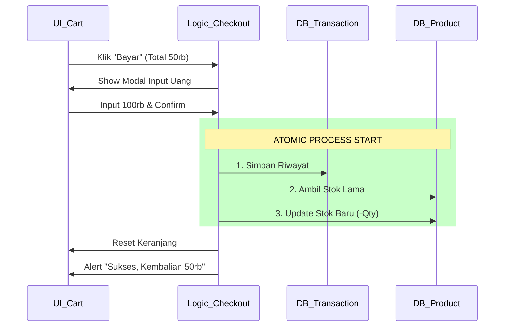

# HARI 9: Transaksi & Pembayaran (Checkout Flow)

**Selamat Datang di Kasir Lanjutan!** 💸

Hari 8 keranjang sudah jadi. Tapi itu belum "Real". Stok di gudang belum berkurang, dan uang belum masuk laci (Transaksi belum tercatat).
Hari ini kita akan mengimplementasikan **Atomic Transaction**: Proses di mana beberapa data berubah sekaligus (Stok berkurang DAN Riwayat bertambah).

**Target Hari Ini:**
1.  **Logic:** Transaksi Atomik (Transaksi + Update Stok).
2.  **UI:** Modal Checkout & Kembalian.
3.  **Consistency:** Memastikan stok tidak minus.

---

## BAGIAN 1: 🔬 Anatomi Syntax (Fundamental Knowledge)

### 1. Atomic Operations ⚛️
*Semua atau Tidak Sama Sekali.*

Dalam database, Transaksi itu harus Atomik.
Bayangkan kamu transfer uang: Uangmu berkurang, Uang temanmu bertambah.
Kalau listrik mati di tengah jalan: Uangmu berkurang, tapi Uang temanmu BELUM bertambah. Uangnya hilang! Bahaya.

Di aplikasi kita:
1.  Catat Transaksi di Riwayat.
2.  Kurangi Stok Produk.

Kedua proses ini harus sukses. Kalau satu gagal, semua harus dibatalkan (Rollback - walau di LocalStorage manual agak susah, logic kita harus kuat).

**Visualisasi Alur Transaksi:**



### 2. Date Handling (ISO 8601) 📅
*Standar Waktu Internasional.*

*   Jangan simpan tanggal sebagai "Senin, 12 Agustus". Itu susah disortir dan difilter.
*   Gunakan standar ISO: `2025-05-12T08:30:00.000Z`.
    *   Mudah diurutkan (String sort = Time sort).
    *   Bisa diubah ke format lokal apapun (`Intl.DateTimeFormat`).
    *   `new Date().toISOString()`.

---

## BAGIAN 2: 🏗️ Pembangunan Milestones

Kita lanjutkan file `js/pos/index.js`.
Kita butuh Modal Pembayaran (bisa copy modal produk kemarin, atau buat HTML string baru cepat).

### Milestone 1: Modal Pembayaran (`js/pos/index.js`)

Tambahkan fungsi ini di luar `initPOS`.

```javascript
import * as DB from '../db/index.js'; // Akses Penuh ke DB

// Variabel untuk menyimpan Total Tagihan saat ini (biar bisa diakses modal)
let tagihanSaatIni = 0;

function tampilkanModalBayar(total) {
    tagihanSaatIni = total;
    
    // Gunakan teknik HTML String cepat (atau buatElemen kalau mau rapi/reusable)
    const overlay = buatElemen('div', { 
        id: 'modal-bayar',
        style: 'position: fixed; top: 0; left: 0; width: 100%; height: 100%; background: rgba(0,0,0,0.8); display: flex; justify-content: center; align-items: center; z-index: 2000;'
    },
        buatElemen('div', { style: 'background: white; padding: 30px; border-radius: 12px; width: 400px; text-align: center;' },
            buatElemen('h2', {}, 'Konfirmasi Pembayaran'),
            buatElemen('h1', { style: 'color: green; margin: 20px 0;' }, formatKeRupiah(total)),
            
            // Input Uang
            buatElemen('div', { style: 'margin-bottom: 20px;' },
                buatElemen('label', { style: 'display: block; margin-bottom: 5px; font-weight: bold;' }, 'Uang Diterima'),
                buatElemen('input', { 
                    type: 'number', 
                    id: 'input-uang-masuk',
                    style: 'width: 100%; font-size: 24px; padding: 10px; text-align: center;',
                    // Auto Focus nanti kita set
                    onKeyup: hitungKembalianLive
                })
            ),
            
            // Info Kembalian
            buatElemen('div', { style: 'font-size: 18px; margin-bottom: 20px;' }, 
                'Kembalian: ',
                buatElemen('span', { id: 'info-kembalian', style: 'font-weight: bold;' }, '-')
            ),

            // Tombol
            buatElemen('div', { style: 'display: flex; gap: 10px; justify-content: center;' },
                buatElemen('button', { 
                    onClick: tutupModalBayar, 
                    style: 'background: #ccc; border: none; padding: 10px 20px; font-size: 16px; cursor: pointer; border-radius: 5px;' 
                }, 'Batal'),
                buatElemen('button', { 
                    id: 'btn-proses-bayar',
                    onClick: prosesFinalTransaksi, 
                    style: 'background: blue; color: white; border: none; padding: 10px 20px; font-size: 16px; cursor: pointer; border-radius: 5px; opacity: 0.5;',
                    disabled: true 
                }, 'PROSES')
            )
        )
    );

    document.body.appendChild(overlay);
    
    // Focus ke input biar kasir langsung ketik
    setTimeout(() => document.getElementById('input-uang-masuk').focus(), 100);
}

function tutupModalBayar() {
    const el = document.getElementById('modal-bayar');
    if (el) el.remove();
}
```

### Milestone 2: Logic Kembalian Realtime

Kasir butuh tahu kembalian SEBELUM tekan tombol proses.

```javascript
function hitungKembalianLive(e) {
    const uangMasuk = Number(e.target.value);
    const kembalian = uangMasuk - tagihanSaatIni;
    
    const elKembalian = document.getElementById('info-kembalian');
    const btn = document.getElementById('btn-proses-bayar');

    if (uangMasuk >= tagihanSaatIni) {
        // Cukup
        elKembalian.textContent = formatKeRupiah(kembalian);
        elKembalian.style.color = 'black';
        btn.disabled = false;
        btn.style.opacity = 1;

        // Shortcut: Tekan Enter untuk bayar
        if (e.key === 'Enter') prosesFinalTransaksi();
    } else {
        // Kurang
        elKembalian.textContent = "Kurang " + formatKeRupiah(Math.abs(kembalian));
        elKembalian.style.color = 'red';
        btn.disabled = true;
        btn.style.opacity = 0.5;
    }
}
```

### Milestone 3: Logic Transaksi (The Core) 💍

Inilah momen sakral perubahan data.

```javascript
function prosesFinalTransaksi() {
    const uangMasuk = Number(document.getElementById('input-uang-masuk').value);
    
    // 1. Ambil Snapshot Data Keranjang
    const stateKeranjang = keranjangStore.ambilData();
    const user = DB.ambilPenggunaSaatIni();

    // 2. Buat Object Transaksi LENGKAP
    const transaksiBaru = {
        id: Date.now(),
        date: new Date().toISOString(),
        cashier: user ? user.nama : 'Guest',
        items: stateKeranjang.items, // Copy items (PENTING! Ini snapshot harga saat beli)
        total: stateKeranjang.total,
        paid: uangMasuk,
        change: uangMasuk - stateKeranjang.total
    };

    // 3. SIMPAN KE DB TRANSAKSI
    DB.tambahTransaksi(transaksiBaru);

    // 4. UPDATE STOK PRODUK (Pengurangan)
    stateKeranjang.items.forEach(itemBeli => {
        // Ambil data produk asli dari DB (untuk pastikan kita update data terbaru)
        const produkAsli = DB.cariProdukById(itemBeli.id);
        if (produkAsli) {
            const stokBaru = produkAsli.stock - itemBeli.qty;
            // Update DB
            DB.perbaruiProdukById(itemBeli.id, { stock: stokBaru });
        }
    });

    // 5. BERSIH-BERSIH & FEEDBACK
    tutupModalBayar();
    
    // Kosongkan keranjang
    keranjangStore.aturData({ items: [], total: 0 });
    
    // Refresh Katalog (karena stok produk berkurang, tampilan harus update)
    renderKatalog(document.getElementById('pos-katalog')); // Panggil ulang render katalog

    alert(`Transaksi Berhasil!\nKembalian: ${formatKeRupiah(transaksiBaru.change)}`);
}
```

### Milestone 4: Hubungkan Tombol Checkout

Kembali ke `renderKeranjang` (Hari 8), edit tombol "Bayar Sekarang".

```javascript
/* di renderKeranjang */
onClick: () => {
    // Panggil modal
    const total = keranjangStore.ambilData().total;
    tampilkanModalBayar(total);
}
```

---

## BAGIAN 4: 🛠️ Troubleshooting (Masalah Umum)

| Masalah | Penyebab | Solusi |
| :--- | :--- | :--- |
| Stok produk tidak berkurang | Lupa memanggil `DB.perbaruiProdukById` atau ID salah. | Cek loop `items.forEach` di `prosesFinalTransaksi`. |
| Tombol Proses tidak menyala walau uang cukup | Tipe data input string vs number. | Pastikan `Number(input.value)` saat perbandingan. |
| Katalog tidak update (stok masih lama) | Lupa memanggil `renderKatalog` setelah transaksi. | Panggil `renderKatalog` lagi agar mengambil data stok terbaru dari DB. |

---

## BAGIAN 5: 💪 Tugas Pembiasaan (Level Up)

### Tugas 1: The Receipt Printer (Console) 🖨️
Buat fungsi `cetakStruk(transaksi)` yang dipanggil setelah sukses.
Fungsi ini melakukan `console.log` dengan format struk belanja.
```
========== POS LITE ==========
Tanggal: 2023-10-01
Kasir  : Budi
------------------------------
Kopi Susu       x2      30.000
Roti Bakar      x1      15.000
------------------------------
TOTAL                   45.000
BAYAR                   50.000
KEMBALI                  5.000
==============================
```
Gunakan `\n` untuk enter, dan `padEnd()` untuk meratakan teks bon.

### Tugas 2: Stok Habis Error 🚫
Coba skenario: Kasir sudah memasukkan barang ke keranjang (stok sisa 1).
Di saat bersamaan, Admin di komputer lain mengedit stok jadi 0.
Saat Kasir checkout, logic kita harus mengecek ULANG stok real-time DB sebelum mengurangi.
Jika kurang, batalkan transaksi dan beri alert "Stok Berubah! Transaksi Dibatalkan".
*(Ini simulasi Concurrency Control).*

---

**Evaluasi Hari 9:**
Lakukan proses belanja sampai tuntas.
Lalu pergi ke Tab **Produk**.
Lihat stok barang yang kamu beli tadi. Apakah berkurang?
Jika ya, Siklus Bisnis (Duit Masuk, Barang Keluar) sudah berjalan sempurna.

Besok (Hari 10), kita akan melihat hasil kerja keras ini di halaman **Laporan**. Grafik & Angka! 📊

*Sampai jumpa di Hari 10!*
