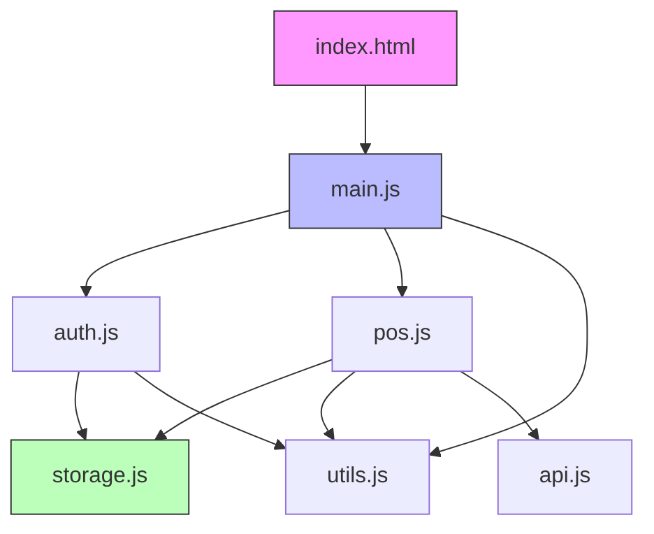
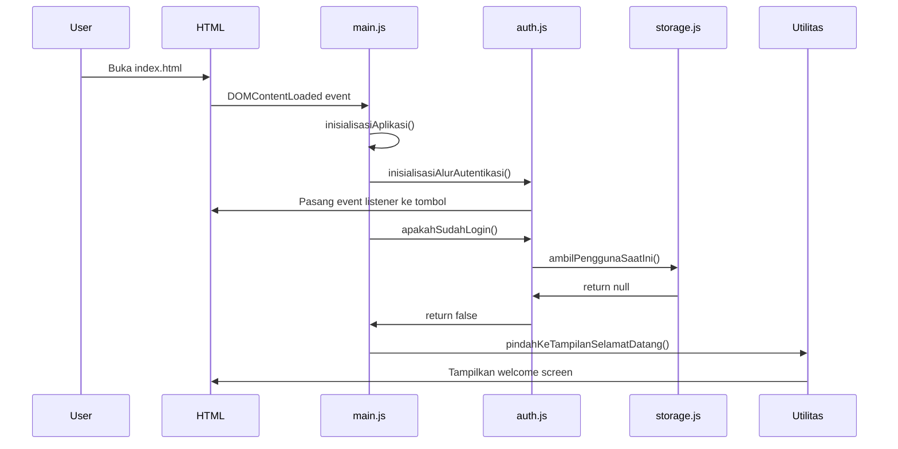
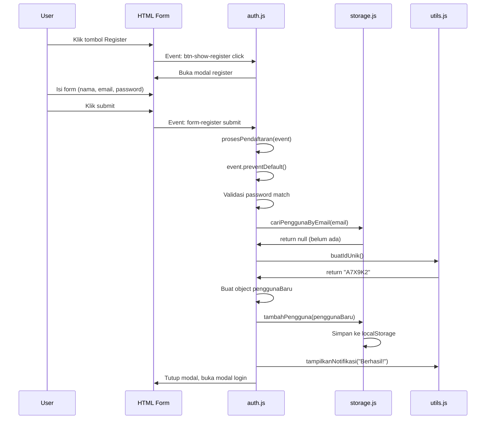
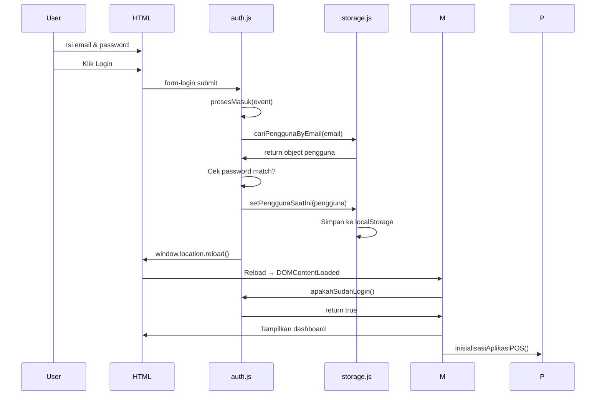

# 📚 Panduan Belajar Lengkap: Aplikasi POS Lite

## Daftar Isi

1. [Pengenalan](#pengenalan)
2. [Arsitektur Aplikasi](#arsitektur-aplikasi)
3. [Konsep Dasar JavaScript Modern](#konsep-dasar-javascript-modern)
4. [Struktur Folder dan File](#struktur-folder-dan-file)
5. [Penjelasan Detail Per File](#penjelasan-detail-per-file)
6. [Alur Kerja Aplikasi](#alur-kerja-aplikasi)
7. [Konsep dan Pattern yang Digunakan](#konsep-dan-pattern-yang-digunakan)
8. [Tips dan Best Practices](#tips-dan-best-practices)

---

## Pengenalan

### Apa itu POSLite?

POSLite adalah **aplikasi Point of Sale (Kasir) sederhana** yang dibangun menggunakan HTML, CSS, dan JavaScript murni (Vanilla JavaScript). Aplikasi ini dibuat khusus untuk **pembelajaran pemrograman web** dengan fokus pada:

- ✅ JavaScript ES6+ Modules
- ✅ LocalStorage sebagai database
- ✅ Manipulasi DOM
- ✅ Event Handling
- ✅ Async/Await dan Fetch API
- ✅ Clean Code dan Separation of Concerns

### Fitur Aplikasi

1. **Autentikasi**: Register dan Login pengguna
2. **Manajemen Produk**: Tambah, Edit, Hapus produk
3. **Import Produk**: Ambil data dari FakeStoreAPI
4. **POS (Kasir)**: Tambah produk ke keranjang dan checkout
5. **Laporan**: Melihat history transaksi

---

## Arsitektur Aplikasi

### Diagram Arsitektur



### Penjelasan Arsitektur

**Layer 1: Presentation (index.html)**

- File HTML yang berisi struktur tampilan
- Form, button, modal, tabel

**Layer 2: Entry Point (main.js)**

- Titik masuk aplikasi
- Mengatur inisialisasi semua modul

**Layer 3: Business Logic**

- `auth.js`: Logika autentikasi
- `pos.js`: Logika POS utama
- `api.js`: Komunikasi dengan API eksternal

**Layer 4: Utilities & Storage**

- `utils.js`: Fungsi-fungsi helper
- `storage.js`: Interaksi dengan localStorage

---

## Konsep Dasar JavaScript Modern

### 1. ES6 Modules (Import/Export)

**Apa itu Module?**
Module adalah cara untuk memecah kode menjadi file-file terpisah yang bisa digunakan ulang.

**Kenapa pakai Module?**

- ✅ Kode lebih terorganisir
- ✅ Mudah maintenance
- ✅ Bisa reuse fungsi
- ✅ Menghindari konflik nama variabel

**Cara Export Fungsi:**

```javascript
// Di file utils.js
export function buatIdUnik() {
    // kode...
}

export function formatKeRupiah(angka) {
    // kode...
}
```

**Cara Import Fungsi:**

```javascript
// Di file main.js
import * as Utilitas from './utils.js';

// Cara pakai:
const id = Utilitas.buatIdUnik();
const harga = Utilitas.formatKeRupiah(50000);
```

**Penjelasan `import * as`:**

- `*` = ambil semua export
- `as Utilitas` = beri nama alias "Utilitas"
- Jadi semua fungsi dari utils.js bisa diakses via `Utilitas.namaFungsi()`

### 2. LocalStorage

**Apa itu LocalStorage?**
LocalStorage adalah tempat penyimpanan data di browser yang **persisten** (tidak hilang saat browser ditutup).

**Cara Kerja:**

```javascript
// Simpan data (harus string)
localStorage.setItem('kunci', 'nilai');

// Ambil data
const nilai = localStorage.getItem('kunci');

// Hapus data
localStorage.removeItem('kunci');

// Simpan object (harus di-convert ke JSON)
const pengguna = { nama: 'Budi', email: 'budi@mail.com' };
localStorage.setItem('pengguna', JSON.stringify(pengguna));

// Ambil object (parsing JSON ke object)
const penggunaString = localStorage.getItem('pengguna');
const penggunaObject = JSON.parse(penggunaString);
```

### 3. Arrow Function

**Sintaks Lama (ES5):**

```javascript
function tambah(a, b) {
    return a + b;
}
```

**Sintaks Baru (ES6 Arrow Function):**

```javascript
const tambah = (a, b) => {
    return a + b;
}

// Atau lebih ringkas (implicit return):
const tambah = (a, b) => a + b;
```

**Kapan pakai Arrow Function?**

- Untuk fungsi callback
- Untuk fungsi yang pendek
- Saat butuh `this` dari parent scope

### 4. Async/Await

**Masalah: Kode Asynchronous**

```javascript
// Tanpa await - tidak tunggu selesai
function ambilData() {
    fetch('https://api.com/data')
        .then(response => response.json())
        .then(data => console.log(data));
}
```

**Solusi: Async/Await**

```javascript
// Dengan await - tunggu sampai selesai
async function ambilData() {
    const respons = await fetch('https://api.com/data');
    const data = await respons.json();
    console.log(data);
}
```

**Penjelasan:**

- `async` = fungsi ini bersifat asynchronous
- `await` = tunggu sampai proses selesai
- Lebih mudah dibaca seperti kode synchronous

---

## Struktur Folder dan File

```
pos-lite/
├── index.html          # Halaman utama
├── styles.css          # Styling aplikasi
└── js/
    ├── main.js         # Entry point
    ├── auth.js         # Autentikasi
    ├── pos.js          # Logika POS
    ├── storage.js      # LocalStorage
    ├── utils.js        # Helper functions
    └── api.js          # Fetch API eksternal
```

---

## Penjelasan Detail Per File

## 📄 File 1: main.js

### Tujuan File Ini

File ini adalah **pintu masuk aplikasi**. Dijalankan pertama kali saat halaman dimuat.

### Kode Lengkap dengan Penjelasan

```javascript
/**
 * main.js
 * Entry Point aplikasi.
 * Dijalankan saat browser selesai memuat halaman.
 */

// IMPORT MODULES
// ===============
// Import semua modul yang dibutuhkan
import * as Autentikasi from './auth.js';
import * as POS from './pos.js';
import * as Utilitas from './utils.js';
import * as Penyimpanan from './storage.js';
```

**Penjelasan Import:**

- Kita import 4 modul sebagai object
- `* as Autentikasi` = semua export dari auth.js bisa diakses via `Autentikasi.namaFungsi()`
- Kenapa pakai `* as`? Karena kita butuh banyak fungsi dari tiap modul

```javascript
// FUNGSI UTAMA INISIALISASI
// ==========================
function inisialisasiAplikasi() {
    console.log('POSLite App Initializing...');
```

**Penjelasan:**

- Fungsi ini dipanggil sekali saat aplikasi pertama kali jalan
- `console.log()` untuk debugging - muncul di DevTools console

```javascript
    // 1. Setup Alur Autentikasi (Event listeners untuk login/register)
    Autentikasi.inisialisasiAlurAutentikasi();
```

**Penjelasan:**

- Memanggil fungsi dari modul Autentikasi
- Fungsi ini akan memasang event listener ke tombol-tombol login/register
- Event listener = kode yang mendengarkan aksi user (klik, ketik, dll)

```javascript
    // 2. Cek Status Login
    if (Autentikasi.apakahSudahLogin()) {
```

**Penjelasan:**

- `if` = percabangan
- `Autentikasi.apakahSudahLogin()` = fungsi yang return `true` atau `false`
- Jika ada pengguna yang login, masuk ke blok if

```javascript
        // Jika pengguna sudah login
        const pengguna = Penyimpanan.ambilPenggunaSaatIni();
        console.log('User logged in:', pengguna.name);
```

**Penjelasan:**

- `const` = deklarasi variabel yang tidak bisa diubah
- `Penyimpanan.ambilPenggunaSaatIni()` = ambil data pengguna dari localStorage
- `pengguna.name` = akses property 'name' dari object pengguna

```javascript
        // Update UI nama pengguna
        document.getElementById('user-display-name').textContent = pengguna.name;
```

**Penjelasan:**

- `document.getElementById()` = cari elemen HTML dengan id tertentu
- `.textContent` = ubah isi teks elemen tersebut
- Jadi nama pengguna ditampilkan di UI

```javascript
        // Pindah ke Dashboard
        Utilitas.pindahKeTampilanUtama();
```

**Penjelasan:**

- Memanggil fungsi untuk hide welcome screen dan show dashboard
- Fungsi ini manipulasi class CSS (add/remove 'hidden')

```javascript
        // Inisialisasi Logika POS
        POS.inisialisasiAplikasiPOS();
```

**Penjelasan:**

- Setup semua event listener untuk fitur POS (produk, keranjang, dll)
- Fungsi ini baru dipanggil kalau user sudah login

```javascript
    } else {
        // Jika belum login
        console.log('User not logged in. Showing welcome screen.');
        Utilitas.pindahKeTampilanSelamatDatang();
    }
}
```

**Penjelasan:**

- Blok `else` = dijalankan jika kondisi `if` false
- Jika belum login, tampilkan welcome screen

```javascript
// Jalankan inisialisasiAplikasi saat DOM siap
document.addEventListener('DOMContentLoaded', inisialisasiAplikasi);
```

**Penjelasan:**

- `addEventListener` = pasang listener untuk event
- `'DOMContentLoaded'` = event yang fire saat HTML selesai dimuat
- `inisialisasiAplikasi` = fungsi callback yang dipanggil saat event terjadi
- Kenapa pakai ini? Karena kita harus tunggu HTML selesai dimuat dulu sebelum manipulasi DOM

---

## 📄 File 2: storage.js

### Tujuan File Ini

File ini bertindak sebagai **Database Layer**. Semua operasi baca/tulis ke localStorage dilakukan di sini.

### Konsep: Separation of Concerns

Kenapa pisahkan storage ke file terpisah?

- ✅ Mudah ganti database (misal dari localStorage ke API)
- ✅ Fungsi storage bisa dipakai di banyak tempat
- ✅ Kode lebih terorganisir

### Kode Lengkap dengan Penjelasan

```javascript
/**
 * storage.js
 * Berisi semua logika untuk menyimpan dan mengambil data dari localStorage.
 * Bertindak sebagai "Database" sederhana.
 */

// KONSTANTA KUNCI PENYIMPANAN
// ============================
const KUNCI_PENYIMPANAN = {
    PENGGUNA: 'pos_pengguna',
    PENGGUNA_SAAT_INI: 'pos_pengguna_saat_ini',
    STATE_POS: 'pos_state'
};
```

**Penjelasan:**

- `const` dengan huruf kapital = konstanta global
- Object berisi kunci-kunci untuk localStorage
- Kenapa pakai konstanta? Agar tidak typo dan mudah ubah
- Contoh: `KUNCI_PENYIMPANAN.PENGGUNA` = `'pos_pengguna'`

```javascript
// --- MANAJEMEN PENGGUNA ---

// Ambil semua pengguna
export function ambilSemuaPengguna() {
    const jsonPengguna = localStorage.getItem(KUNCI_PENYIMPANAN.PENGGUNA);
    return jsonPengguna ? JSON.parse(jsonPengguna) : [];
}
```

**Penjelasan Baris per Baris:**

**Baris 1:** `export function ambilSemuaPengguna()`

- `export` = fungsi ini bisa di-import oleh file lain
- `function` = deklarasi fungsi
- `ambilSemuaPengguna()` = nama fungsi tanpa parameter

**Baris 2:** `const jsonPengguna = localStorage.getItem(KUNCI_PENYIMPANAN.PENGGUNA);`

- `localStorage.getItem()` = ambil data dari localStorage
- Hasilnya berupa string JSON atau `null` jika tidak ada
- Disimpan ke variabel `jsonPengguna`

**Baris 3:** `return jsonPengguna ? JSON.parse(jsonPengguna) : [];`

- Ini adalah **Ternary Operator**: `kondisi ? nilaiJikaTrue : nilaiJikaFalse`
- Kondisi: `jsonPengguna` (truthy jika ada data)
- Jika ada: `JSON.parse(jsonPengguna)` = convert string JSON ke array
- Jika tidak ada: `[]` = return array kosong
- **Kenapa perlu JSON.parse?** LocalStorage hanya bisa simpan string, jadi kita convert string kembali ke object/array

```javascript
// Simpan semua pengguna (timpa data)
export function simpanSemuaPengguna(daftarPengguna) {
    localStorage.setItem(KUNCI_PENYIMPANAN.PENGGUNA, JSON.stringify(daftarPengguna));
}
```

**Penjelasan:**

- `daftarPengguna` = parameter berupa array
- `JSON.stringify()` = convert array/object ke string JSON
- `localStorage.setItem()` = simpan ke localStorage
- **Kenapa JSON.stringify?** LocalStorage hanya terima string

```javascript
// Cari pengguna berdasarkan email
export function cariPenggunaByEmail(email) {
    const daftarPengguna = ambilSemuaPengguna();
    return daftarPengguna.find(pengguna => pengguna.email === email);
}
```

**Penjelasan:**

**Method Array: `.find()`**

- `.find()` = mencari element pertama yang memenuhi kondisi
- Parameter: callback function
- Return: element yang ditemukan atau `undefined`

**Arrow Function:** `pengguna => pengguna.email === email`

- `pengguna` = parameter (setiap item dalam array)
- `=>` = arrow function syntax
- `pengguna.email === email` = kondisi: apakah email cocok?
- `===` = strict equality (cek nilai dan tipe data)

**Contoh:**

```javascript
const users = [
    { email: 'andi@mail.com', name: 'Andi' },
    { email: 'budi@mail.com', name: 'Budi' }
];

const hasil = users.find(pengguna => pengguna.email === 'budi@mail.com');
// hasil = { email: 'budi@mail.com', name: 'Budi' }
```

```javascript
// Tambah pengguna baru
export function tambahPengguna(pengguna) {
    const daftarPengguna = ambilSemuaPengguna();
    daftarPengguna.push(pengguna);
    simpanSemuaPengguna(daftarPengguna);
}
```

**Penjelasan Flow:**

1. Ambil semua pengguna yang ada (array)
2. `.push()` = tambahkan element baru ke akhir array
3. Simpan kembali ke localStorage

```javascript
// Ambil state POS (jika kosong, return struktur default)
export function ambilStatePOS() {
    const jsonState = localStorage.getItem(KUNCI_PENYIMPANAN.STATE_POS);
    if (jsonState) {
        return JSON.parse(jsonState);
    } else {
        // State default jika belum ada data
        return {
            produk: [],
            transaksi: []
        };
    }
}
```

**Penjelasan:**

- Cek apakah ada data state di localStorage
- Jika ada: parse dan return
- Jika tidak: return object default dengan array kosong
- **Kenapa perlu default?** Agar aplikasi tidak error saat pertama kali jalan

```javascript
export function perbaruiProdukById(id, dataBaru) {
    const state = ambilStatePOS();
    const indeks = state.produk.findIndex(produk => produk.id === id);

    if (indeks !== -1) {
        // Gabungkan data lama dengan data baru
        state.produk[indeks] = { ...state.produk[indeks], ...dataBaru };
        simpanStatePOS(state);
        return true;
    }
    return false;
}
```

**Penjelasan Konsep Penting:**

**Method `.findIndex()`:**

- Mirip `.find()` tapi return index (posisi) bukan element
- Return `-1` jika tidak ditemukan

**Spread Operator (`...`):**

```javascript
{ ...state.produk[indeks], ...dataBaru }
```

- `...` = spread operator, "sebarkan" semua property
- Gabungkan object lama dengan object baru
- Property di dataBaru akan overwrite yang lama

**Contoh:**

```javascript
const produkLama = { id: '123', name: 'Laptop', price: 5000000 };
const dataBaru = { price: 4500000, stock: 10 };

const hasil = { ...produkLama, ...dataBaru };
// hasil = { id: '123', name: 'Laptop', price: 4500000, stock: 10 }
```

---

## 📄 File 3: utils.js

### Tujuan File Ini

File ini berisi **fungsi-fungsi helper** yang dipakai di banyak tempat dalam aplikasi.

### Konsep: DRY (Don't Repeat Yourself)

Kenapa buat file utils?

- ✅ Fungsi yang sama tidak ditulis ulang
- ✅ Mudah maintain - ubah 1 tempat, semua update
- ✅ Testing lebih mudah

### Kode Lengkap dengan Penjelasan

```javascript
// 1. Buat ID unik sederhana
export function buatIdUnik() {
    const karakter = 'ABCDEFGHIJKLMNOPQRSTUVWXYZ';
    const angka = '0123456789';
    const gabungan = karakter + angka;
    let hasil = '';
    for (let indeks = 0; indeks < 6; indeks++) {
        hasil += gabungan.charAt(Math.floor(Math.random() * gabungan.length));
    }
    return hasil;
}
```

**Penjelasan Algoritma:**

**Step 1:** Definisikan karakter yang boleh dipakai

```javascript
const gabungan = 'ABCDEFGHIJKLMNOPQRSTUVWXYZ0123456789';
```

**Step 2:** Loop 6 kali untuk buat string 6 karakter

```javascript
for (let indeks = 0; indeks < 6; indeks++) {
```

- `let indeks = 0` = inisialisasi
- `indeks < 6` = kondisi
- `indeks++` = increment (tambah 1 setiap loop)

**Step 3:** Ambil karakter random

```javascript
hasil += gabungan.charAt(Math.floor(Math.random() * gabungan.length));
```

**Penjelasan Detail:**

- `Math.random()` = angka random 0-1 (contoh: 0.7234)
- `gabungan.length` = panjang string (36)
- `Math.random() * 36` = angka decimal 0-36 (contoh: 26.04)
- `Math.floor()` = bulatkan ke bawah (26.04 → 26)
- `.charAt(26)` = ambil karakter ke-26 dari string
- `+=` = tambahkan ke string `hasil`

**Contoh Hasil:** `'A7X9K2'`, `'B3M8P1'`, dll

```javascript
// 2. Format angka ke format mata uang (Rupiah)
export function formatKeRupiah(jumlahAngka) {
    return new Intl.NumberFormat('id-ID', {
        style: 'currency',
        currency: 'IDR',
        minimumFractionDigits: 0
    }).format(jumlahAngka);
}
```

**Penjelasan Intl.NumberFormat:**

**Apa itu Intl?**

- `Intl` = Internationalization API (bawaan JavaScript)
- Untuk format angka, tanggal, dll sesuai locale

**Parameter:**

- `'id-ID'` = locale Indonesia
- `style: 'currency'` = format sebagai mata uang
- `currency: 'IDR'` = Rupiah Indonesia
- `minimumFractionDigits: 0` = tanpa desimal

**Contoh:**

```javascript
formatKeRupiah(50000);  // "Rp50.000"
formatKeRupiah(1500000); // "Rp1.500.000"
```

```javascript
// 3. Menampilkan notifikasi (Toast)
export function tampilkanNotifikasi(pesan, tipe = 'info') {
    const kontainer = document.getElementById('notification-container');

    // Buat elemen notifikasi
    const notifikasi = document.createElement('div');
    notifikasi.className = `notification ${tipe}`;
    notifikasi.textContent = pesan;

    // Masukkan ke container
    kontainer.appendChild(notifikasi);

    // Hapus otomatis setelah 3 detik
    setTimeout(() => {
        notifikasi.remove();
    }, 3000);
}
```

**Penjelasan DOM Manipulation:**

**Step 1:** Cari container di HTML

```javascript
const kontainer = document.getElementById('notification-container');
```

**Step 2:** Buat elemen div baru

```javascript
const notifikasi = document.createElement('div');
```

- Membuat `<div></div>` di memori (belum di-attach ke DOM)

**Step 3:** Set class dan teks

```javascript
notifikasi.className = `notification ${tipe}`;
notifikasi.textContent = pesan;
```

- Template literal: `` `notification ${tipe}` ``
- Contoh: jika `tipe = 'error'`, maka class = `'notification error'`

**Step 4:** Masukkan ke DOM

```javascript
kontainer.appendChild(notifikasi);
```

- `.appendChild()` = tambahkan sebagai child

**Step 5:** Auto hapus setelah 3 detik

```javascript
setTimeout(() => {
    notifikasi.remove();
}, 3000);
```

- `setTimeout()` = jalankan fungsi setelah delay
- `3000` = 3000 milidetik = 3 detik
- Arrow function `() => {...}` = callback yang dijalankan

```javascript
// 8. Potong Teks
export function potongTeks(teks, panjangMaksimal) {
    if (teks.length > panjangMaksimal) {
        return teks.substring(0, panjangMaksimal) + '...';
    }
    return teks;
}
```

**Penjelasan `.substring()`:**

- `.substring(start, end)` = ambil sebagian string
- `teks.substring(0, 20)` = ambil karakter 0-19 (20 karakter)
- Tambahkan `'...'` untuk indikasi terpotong

**Contoh:**

```javascript
potongTeks('Laptop Gaming ASUS ROG', 15);
// "Laptop Gaming A..."

potongTeks('Mouse', 15);
// "Mouse"
```

---

## 📄 File 4: api.js

### Tujuan File Ini

File ini menangani **komunikasi dengan API eksternal** (FakeStoreAPI).

### Konsep: Fetch API

**Apa itu Fetch?**

- Fetch = fungsi bawaan JavaScript untuk HTTP request
- Digunakan untuk ambil data dari server/API
- Return Promise (asynchronous)

### Kode Lengkap dengan Penjelasan

```javascript
export async function ambilProdukDariAPI(batas = 5) {
    const urlAPI = `https://fakestoreapi.com/products?limit=${batas}`;
    try {
        console.log(`Mengambil ${batas} produk dari FakeStoreAPI...`);
        const respons = await fetch(urlAPI);

        if (!respons.ok) throw new Error('Gagal mengambil data produk');

        const dataProduk = await respons.json();
        return dataProduk;
    } catch (kesalahan) {
        console.error('Error saat mengambil produk:', kesalahan);
        return [];
    }
}
```

**Penjelasan Konsep Penting:**

**1. Async Function**

```javascript
async function ambilProdukDariAPI(batas = 5) {
```

- `async` = fungsi ini bersifat asynchronous
- `batas = 5` = default parameter (jika tidak diisi, pakai 5)

**2. Query Parameter di URL**

```javascript
const urlAPI = `https://fakestoreapi.com/products?limit=${batas}`;
```

- `?limit=5` = query parameter
- Format: `?nama=nilai`
- Multiple parameter: `?limit=5&category=electronics`

**3. Try-Catch Block**

```javascript
try {
    // kode yang mungkin error
} catch (kesalahan) {
    // tangani error
}
```

- `try` = coba jalankan kode ini
- `catch` = kalau ada error, jalankan blok ini
- `kesalahan` = object error yang ditangkap

**4. Await Fetch**

```javascript
const respons = await fetch(urlAPI);
```

- `fetch(urlAPI)` = kirim GET request ke URL
- `await` = tunggu sampai request selesai
- `respons` = object Response dari server

**5. Cek Status Response**

```javascript
if (!respons.ok) throw new Error('Gagal mengambil data produk');
```

- `respons.ok` = true jika status 200-299
- `!respons.ok` = negasi (NOT)
- `throw new Error()` = lempar error (masuk ke catch)

**6. Parse JSON**

```javascript
const dataProduk = await respons.json();
```

- `.json()` = parse response body sebagai JSON
- Juga async, jadi pakai `await`
- Return array/object

**7. Error Handling**

```javascript
catch (kesalahan) {
    console.error('Error saat mengambil produk:', kesalahan);
    return [];
}
```

- `console.error()` = log error ke console
- `return []` = return array kosong agar aplikasi tidak crash

**Flow Diagram:**

```
User klik "Import Produk"
    ↓
Panggil ambilProdukDariAPI(5)
    ↓
Fetch ke https://fakestoreapi.com/products?limit=5
    ↓
Tunggu response (await)
    ↓
Cek status response (ok?)
    ↓
Parse JSON (await)
    ↓
Return array produk
```

---

## 📄 File 5: auth.js

### Tujuan File Ini

File ini adalah **Satpam Aplikasi**. Mengurus siapa yang boleh masuk (Login) dan pendaftaran anggota baru (Register).

### Kode Lengkap dengan Penjelasan

```javascript
/**
 * auth.js
 * Menangani logika autentikasi: Login, Register, Logout.
 */

import * as Penyimpanan from './storage.js';
import * as Utilitas from './utils.js';
```

#### 1. Logika Register (Pendaftaran)

```javascript
function prosesPendaftaran(event) {
    event.preventDefault(); // 1. Cegah reload halaman

    // 2. Ambil nilai dari form
    const nama = document.getElementById('reg-name').value;
    const email = document.getElementById('reg-email').value;
    const kataSandi = document.getElementById('reg-password').value;
    const konfirmasiKataSandi = document.getElementById('reg-confirm-password').value;

    // 3. Validasi Password
    if (kataSandi !== konfirmasiKataSandi) {
        Utilitas.tampilkanNotifikasi('Password tidak sama!', 'error');
        return; // Stop di sini jika gagal
    }

    // 4. Cek apakah email sudah terdaftar?
    const penggunaAda = Penyimpanan.cariPenggunaByEmail(email);
    if (penggunaAda) {
        Utilitas.tampilkanNotifikasi('Email sudah terdaftar!', 'error');
        return;
    }

    // 5. Buat object pengguna baru
    const penggunaBaru = {
        id: Utilitas.buatIdUnik(), // Generate ID unik
        name: nama,
        email: email,
        password: kataSandi, // Note: Di real app, password HARUS di-hash!
        createdAt: new Date().toISOString()
    };

    // 6. Simpan ke database
    Penyimpanan.tambahPengguna(penggunaBaru);
    
    Utilitas.tampilkanNotifikasi('Registrasi berhasil! Silakan login.', 'success');
    
    // 7. Reset form dan tutup modal
    document.getElementById('form-register').reset();
    document.getElementById('register-modal').classList.add('hidden');
    document.getElementById('login-modal').classList.remove('hidden');
}
```

**Poin Belajar Penting:**

- **Validasi Input**: Selalu cek input user sebelum diproses (password match, email duplikat).
- **Object Creation**: Kita membungkus data user dalam satu object rapi.
- **UX Flow**: Setelah register sukses, user langsung diarahkan ke form login (langkah 7).

#### 2. Logika Login (Masuk)

```javascript
function prosesMasuk(event) {
    event.preventDefault();

    const email = document.getElementById('login-email').value;
    const kataSandi = document.getElementById('login-password').value;

    // 1. Cari user di database
    const pengguna = Penyimpanan.cariPenggunaByEmail(email);

    // 2. Validasi User & Password
    if (pengguna && pengguna.password === kataSandi) {
        // LOGIN SUKSES
        
        // 3. Simpan sesi login
        Penyimpanan.setPenggunaSaatIni(pengguna);
        
        Utilitas.tampilkanNotifikasi('Login berhasil!', 'success');
        
        // 4. Reload halaman untuk masuk ke dashboard
        setTimeout(() => {
            window.location.reload();
        }, 1000);
        
    } else {
        // LOGIN GAGAL
        Utilitas.tampilkanNotifikasi('Email atau password salah!', 'error');
    }
}
```

**Poin Belajar Penting:**

- **Session Management**: Saat login sukses, kita simpan data user di `localStorage` (via `setPenggunaSaatIni`). Ini yang membuat user tetap login meski browser ditutup.
- **Security Note**: Di aplikasi nyata, jangan pernah simpan password mentah (plain text) dan jangan validasi password di client-side saja. Ini hanya untuk belajar logika dasar.

---

## 📄 File 6: pos.js (The Brain 🧠)

### Tujuan File Ini

Ini adalah **Otak Aplikasi**. File paling kompleks yang menangani:

1. CRUD Produk (Create, Read, Update, Delete)
2. Logika Keranjang Belanja (Add to cart, calculate total)
3. Transaksi & Laporan

### Bedah Kode: Logika Keranjang Belanja

Salah satu fitur tersulit bagi pemula adalah logika keranjang. Mari kita bedah:

```javascript
// State Lokal untuk keranjang (hanya hidup selama halaman dibuka)
let keranjangBelanja = [];

// Fungsi Global (di-attach ke window agar bisa dipanggil dari HTML onclick)
window.tambahKeKeranjang = (idProduk) => {
    // 1. Cari data produk aslinya
    const produk = Penyimpanan.cariProdukById(idProduk);
    
    // 2. Cek: Apakah produk ini SUDAH ada di keranjang?
    const itemAda = keranjangBelanja.find(item => item.id === idProduk);

    if (itemAda) {
        // SKENARIO A: Produk sudah ada
        // Cukup tambahkan jumlahnya (qty)
        itemAda.qty++;
        
        // Update subtotal (Harga x Jumlah)
        itemAda.subtotal = itemAda.price * itemAda.qty;
    } else {
        // SKENARIO B: Produk belum ada
        // Masukkan sebagai item baru
        keranjangBelanja.push({
            ...produk,      // Copy semua data produk
            qty: 1,         // Set jumlah awal 1
            subtotal: produk.price // Subtotal awal = harga
        });
    }

    // 3. Update tampilan keranjang
    renderKeranjang();
    Utilitas.tampilkanNotifikasi('Produk masuk keranjang', 'success');
};
```

**Konsep: State Mutation vs Immutability**
Di sini kita melakukan **mutasi state** (`itemAda.qty++`). Dalam framework modern seperti React, ini sering dihindari, tapi di Vanilla JS ini cara yang efisien dan mudah dimengerti.

### Bedah Kode: Rendering Keranjang & Kalkulasi Total

```javascript
function renderKeranjang() {
    const container = document.getElementById('cart-items-container');
    container.innerHTML = ''; // Reset tampilan

    let totalHarga = 0;
    let totalJumlah = 0;

    // Loop setiap item di keranjang
    keranjangBelanja.forEach(item => {
        // 1. Akumulasi Total
        totalHarga += item.subtotal;
        totalJumlah += item.qty;

        // 2. Buat HTML untuk item ini
        const div = document.createElement('div');
        div.className = 'cart-item';
        div.innerHTML = `
            <div class="item-info">
                <h4>${item.name}</h4>
                <p>${item.qty} x ${Utilitas.formatKeRupiah(item.price)}</p>
            </div>
            <div class="item-total">
                ${Utilitas.formatKeRupiah(item.subtotal)}
            </div>
        `;
        container.appendChild(div);
    });

    // 3. Update Angka Total di UI
    document.getElementById('cart-total-qty').textContent = totalJumlah;
    document.getElementById('cart-total-price').textContent = Utilitas.formatKeRupiah(totalHarga);
}
```

**Poin Belajar:**

- **Accumulator Pattern**: Variabel `totalHarga` dimulai dari 0, lalu ditambah terus di dalam loop (`+=`). Ini pola standar untuk menghitung total.
- **Dynamic HTML**: Kita membangun HTML menggunakan JavaScript (`createElement`, `innerHTML`) berdasarkan data array.

---

## 🎨 File 7: styles.css (The Look)

### Tujuan File Ini

Mengatur tampilan agar cantik dan responsif. Kita menggunakan **Modern CSS**.

### Konsep Utama: Flexbox & Grid

#### 1. Layout Utama (Flexbox)

```css
body {
    display: flex;
    flex-direction: column;
    min-height: 100vh;
}
```

- `display: flex`: Mengaktifkan mode layout fleksibel.

- `flex-direction: column`: Elemen disusun dari atas ke bawah.
- `min-height: 100vh`: Tinggi minimal adalah 100% layar (Viewport Height).

#### 2. Grid Produk (CSS Grid)

```css
.product-grid {
    display: grid;
    /* Responsive Column Magic */
    grid-template-columns: repeat(auto-fill, minmax(200px, 1fr));
    gap: 20px;
}
```

- **Magic Code**: `repeat(auto-fill, minmax(200px, 1fr))`
  - Ini membuat kolom otomatis bertambah/berkurang sesuai lebar layar.
  - Minimal lebar kolom 200px.
  - Jika ada sisa ruang, bagi rata (`1fr`).
  - **Hasil**: Responsif tanpa media query yang ribet!

#### 3. Modal (Overlay)

```css
.modal-overlay {
    position: fixed; /* Tetap di tempat saat scroll */
    top: 0; left: 0; width: 100%; height: 100%;
    background: rgba(0, 0, 0, 0.5); /* Hitam transparan */
    display: flex;
    justify-content: center; /* Tengah horizontal */
    align-items: center; /* Tengah vertikal */
    z-index: 1000; /* Selalu di atas */
}
```

- Teknik klasik untuk membuat modal yang selalu di tengah layar.

---

## 🛠 Skenario Error & Debugging

Bagian ini penting! Apa yang harus dilakukan kalau aplikasi error?

### Skenario 1: "Produk tidak muncul di tabel!"

**Kemungkinan Penyebab:**

1. LocalStorage kosong atau corrupt.
2. Ada error JavaScript yang menghentikan eksekusi.

**Cara Debug:**

1. Buka **Console** (Klik kanan -> Inspect -> Console).
2. Apakah ada tulisan merah? Baca error-nya.
3. Cek tab **Application** -> **Local Storage**. Apakah ada data di `pos_state`?
4. Coba ketik di Console: `localStorage.clear()` lalu refresh.

### Skenario 2: "Gambar produk broken/rusak"

**Penyebab:**
Link gambar mati atau internet offline.

**Solusi (Defensive Coding):**
Di `pos.js` kita sudah pasang pengaman:

```html

```

Ini akan otomatis ganti gambar jadi placeholder kalau gagal load.

### Skenario 3: "Total harga NaN (Not a Number)"

**Penyebab:**
Salah satu produk punya harga yang bukan angka (misal string "5000" bukan number 5000).

**Cara Debug:**
Cek saat input produk. Pastikan `parseInt()` digunakan:

```javascript
const harga = parseInt(document.getElementById('prod-price').value);
```

---

---

---

## 🧠 Bedah Logika Lanjutan (Advanced Logic)

Bagian ini membahas logika-logika yang lebih kompleks dan "tersembunyi" di dalam aplikasi.

### 1. Logika Checkout & Manajemen Stok (`pos.js`)

Fitur Checkout adalah proses paling krusial karena melibatkan banyak perubahan data sekaligus.

**Kode:**

```javascript
function prosesCheckout() {
    // 1. Validasi Stok Dulu!
    // Kita harus pastikan stok cukup SEBELUM mengurangi apapun.
    for (const item of keranjangBelanja) {
        const produkAsli = Penyimpanan.cariProdukById(item.id);
        if (produkAsli.stock < item.qty) {
            Utilitas.tampilkanNotifikasi(`Stok ${item.name} tidak cukup!`, 'error');
            return; // Batalkan seluruh transaksi
        }
    }

    // 2. Kurangi Stok (Mutasi Data Produk)
    keranjangBelanja.forEach(item => {
        const produkAsli = Penyimpanan.cariProdukById(item.id);
        const stokBaru = produkAsli.stock - item.qty;
        
        // Update stok di database
        Penyimpanan.perbaruiProdukById(item.id, { stock: stokBaru });
    });

    // 3. Simpan Riwayat Transaksi
    const transaksiBaru = {
        id: Utilitas.buatIdUnik(),
        date: new Date().toISOString(), // Waktu standar ISO
        items: keranjangBelanja,        // Simpan snapshot item saat harga ini
        totalPrice: totalHargaKeranjang,
        paymentMethod: 'cash'           // Hardcode dulu
    };
    Penyimpanan.tambahTransaksi(transaksiBaru);

    // 4. Reset Keranjang & UI
    keranjangBelanja = [];
    renderKeranjang();
    tampilkanKatalogPOS(); // Refresh katalog biar stok terupdate visualnya
    Utilitas.tampilkanNotifikasi('Transaksi Berhasil!', 'success');
}
```

**Poin Penting:**
- **Atomic Operation (Simulasi)**: Kita melakukan validasi stok untuk *semua* item dulu (Langkah 1). Jika ada satu saja yang gagal, *tidak ada* stok yang dikurangi. Ini mencegah data tidak konsisten (misal: item A berkurang, item B gagal).
- **Snapshot Data**: Kita menyimpan `items: keranjangBelanja` ke dalam transaksi. Ini penting! Jika nanti harga produk berubah, data di riwayat transaksi *tidak boleh* ikut berubah. Kita simpan harga *saat transaksi terjadi*.

### 2. Event Delegation (Teknik Efisiensi Event)

Di `pos.js`, saat kita merender tabel produk, kita punya tombol Edit dan Delete untuk *setiap* baris.

**Cara Naif (Boros Memori):**
Memasang event listener ke *setiap* tombol satu per satu. Kalau ada 1000 produk, ada 2000 event listener!

**Cara Kita (Event Delegation):**
Kita pasang 1 listener di induknya (Tabel), lalu cek siapa yang diklik.

```javascript
// Di pos.js (konsep)
tabelBody.addEventListener('click', (event) => {
    const target = event.target; // Elemen yang diklik
    
    // Cek apakah yang diklik adalah tombol Delete?
    if (target.classList.contains('btn-delete')) {
        const idProduk = target.dataset.id; // Ambil ID dari data-id="..."
        hapusProduk(idProduk);
    }
    
    // Cek apakah yang diklik adalah tombol Edit?
    if (target.classList.contains('btn-edit')) {
        const idProduk = target.dataset.id;
        editProduk(idProduk);
    }
});
```

*Catatan: Di kode `pos.js` saat ini kita masih attach listener saat render (`baris.querySelector(...)`) untuk kemudahan pemahaman pemula, tapi Event Delegation adalah teknik yang wajib diketahui untuk optimasi.*

### 3. Data Mapping (API Adapter Pattern)

Saat kita ambil data dari FakeStoreAPI (`api.js`), struktur datanya beda dengan struktur aplikasi kita. Kita perlu melakukan **Mapping**.

**Data dari API:**

```json
{
    "id": 1,
    "title": "Tas Keren",  // Beda nama field
    "price": 109.95,
    "image": "url...",
    "category": "men's clothing"
}
```

**Data Aplikasi Kita:**

```javascript
{
    id: "unik...",
    name: "Tas Keren",     // Kita pakai 'name', bukan 'title'
    price: 1500000,        // Kita pakai Rupiah
    stock: 50              // API gak punya stok, kita harus buat sendiri
}
```

**Logika Mapping (`pos.js`):**

```javascript
// Saat import
const produkBaru = {
    id: Utilitas.buatIdUnik(),
    name: produkAPI.title, // Mapping title -> name
    category: produkAPI.category,
    price: Math.round(produkAPI.price * 15000), // Konversi USD -> IDR
    stock: 50, // Default stok
    image: produkAPI.image
};
```

Ini disebut **Adapter Pattern**: mengubah interface (struktur data) asing menjadi interface yang dimengerti aplikasi kita.

---

## 🎨 Bedah Styling System (`styles.css`)

Selain JavaScript, CSS juga punya struktur logic lho!

### 1. CSS Variables (Custom Properties)

Kita mendefinisikan warna di satu tempat (`:root`).

```css
:root {
    /* Color Palette */
    --primary-color: #4f46e5;   /* Indigo utama */
    --secondary-color: #10b981; /* Hijau sukses */
    --danger-color: #ef4444;    /* Merah error */
    --bg-light: #f3f4f6;
    --text-dark: #1f2937;
}
```

**Keuntungan:**
- **Konsistensi**: Warna di seluruh aplikasi pasti sama.
- **Mudah Ganti Tema**: Mau ganti warna utama jadi Merah? Cukup ubah `--primary-color` di satu baris, seluruh aplikasi berubah!

### 2. Utility Classes

Kita membuat class-class kecil yang bisa dipakai ulang (mirip Tailwind CSS tapi manual).

```css
.hidden { display: none !important; }
.text-center { text-align: center; }
.mt-2 { margin-top: 0.5rem; }
```

Di JavaScript (`utils.js`), kita sering pakai `.hidden`:

```javascript
element.classList.add('hidden'); // Sembunyikan
element.classList.remove('hidden'); // Tampilkan
```

Ini cara paling efisien untuk mengatur visibilitas elemen tanpa menyentuh property `style.display` secara langsung di JS.

---

## Alur Kerja Aplikasi

### Flow 1: User Pertama Kali Buka Aplikasi



**Penjelasan Flow:**

1. User buka `index.html` di browser
2. Browser load semua file JavaScript
3. Event `DOMContentLoaded` fire
4. `main.js` jalankan `inisialisasiAplikasi()`
5. Setup event listener untuk login/register
6. Cek apakah user sudah login (cek localStorage)
7. Karena belum ada data, return false
8. Tampilkan welcome screen

### Flow 2: User Register



**Penjelasan Penting:**

**event.preventDefault():**

```javascript
event.preventDefault();
```

- Mencegah bahavior default form (reload page)
- Tanpa ini, halaman akan reload saat submit

**Validasi:**

```javascript
if (kataSandi !== konfirmasiKataSandi) {
    Utilitas.tampilkanNotifikasi('Password tidak sama!', 'error');
    return;
}
```

- `return` = keluar dari fungsi (tidak lanjut eksekusi)

### Flow 3: User Login



**Kenapa Reload?**

```javascript
window.location.reload();
```

- Untuk refresh state aplikasi
- `main.js` akan baca ulang localStorage
- Alternatif: manual update UI (lebih kompleks)

---

## Konsep dan Pattern yang Digunakan

### 1. Module Pattern

**Apa itu?**
Memecah aplikasi menjadi modul-modul kecil yang independent.

**Keuntungan:**

- ✅ Separation of Concerns
- ✅ Reusability
- ✅ Easier Testing
- ✅ Better Organization

**Implementasi di POSLite:**

- `storage.js` = Database layer
- `api.js` = External API layer
- `utils.js` = Helper functions
- `auth.js` = Authentication logic
- `pos.js` = Business logic

### 2. Event-Driven Programming

**Apa itu?**
Program merespons terhadap event (klik, submit, load, dll).

**Contoh:**

```javascript
document.getElementById('btn-add-product').addEventListener('click', () => {
    tampilkanFormProduk();
});
```

**Flow:**

```
User Klik Tombol → Event "click" → Callback Function Dijalankan
```

### 3. CRUD Operations

**Apa itu CRUD?**

- **C**reate = Tambah data baru
- **R**ead = Baca/ambil data
- **U**pdate = Perbarui data
- **D**elete = Hapus data

**Implementasi di POSLite:**

**Create:**

```javascript
export function tambahProduk(produk) {
    const state = ambilStatePOS();
    state.produk.push(produk);
    simpanStatePOS(state);
}
```

**Read:**

```javascript
export function ambilSemuaProduk() {
    const state = ambilStatePOS();
    return state.produk;
}
```

**Update:**

```javascript
export function perbaruiProdukById(id, dataBaru) {
    const state = ambilStatePOS();
    const indeks = state.produk.findIndex(p => p.id === id);
    state.produk[indeks] = { ...state.produk[indeks], ...dataBaru };
    simpanStatePOS(state);
}
```

**Delete:**

```javascript
export function hapusProdukById(id) {
    const state = ambilStatePOS();
    state.produk = state.produk.filter(p => p.id !== id);
    simpanStatePOS(state);
}
```

### 4. State Management

**Apa itu State?**
State = data yang menggambarkan kondisi aplikasi saat ini.

**Contoh State di POSLite:**

```javascript
{
    produk: [
        { id: 'A1B2', name: 'Laptop', price: 5000000, stock: 10 },
        { id: 'C3D4', name: 'Mouse', price: 150000, stock: 25 }
    ],
    transaksi: [
        { id: 'T001', items: [...], totalPrice: 5150000 }
    ]
}
```

**Local State vs Global State:**

- Global State = `storage.js` (localStorage)
- Local State = `let keranjangBelanja = []` di `pos.js`

### 5. Callback Functions

**Apa itu Callback?**
Fungsi yang diberikan sebagai parameter ke fungsi lain.

**Contoh:**

```javascript
// setTimeout menerima callback
setTimeout(() => {
    console.log('3 detik berlalu');
}, 3000);

// Array methods
daftarProduk.forEach(produk => {
    console.log(produk.name);
});

// Event listener
button.addEventListener('click', () => {
    alert('Diklik!');
});
```

---

## Tips dan Best Practices

### 1. Naming Conventions

**Function Names:**

- Gunakan kata kerja: `ambil`, `simpan`, `tampilkan`, `proses`
- Deskriptif: `ambilSemuaProduk()` not `get()`
- camelCase: `inisialisasiAplikasi` not `Inisialisasi_aplikasi`

**Variable Names:**

- Gunakan kata benda: `produk`, `pengguna`, `transaksi`
- Hindari singkatan: `tombol` not `btn`
- camelCase untuk variabel, UPPER_CASE untuk konstanta

### 2. Code Organization

**File Structure:**

```javascript
// 1. Imports di atas
import * as Storage from './storage.js';

// 2. Constants/State
const MAKSIMAL_ITEM = 100;
let keranjangBelanja = [];

// 3. Main function
export function inisialisasi() { }

// 4. Helper functions
function helperFunction() { }
```

### 3. Error Handling

**Selalu handle error:**

```javascript
try {
    const data = await fetchData();
} catch (error) {
    console.error('Error:', error);
    // Fallback behavior
    return defaultValue;
}
```

### 4. Comments

**Good Comments:**

```javascript
// Konversi USD ke IDR (kurs kasar 1:15000)
const hargaIDR = hargaUSD * 15000;
```

**Bad Comments:**

```javascript
// Tambah 1
indeks++;
```

### 5. Debugging Tips

**Console Methods:**

```javascript
console.log('Info biasa');
console.error('Error message');
console.warn('Warning');
console.table(arrayOfObjects); // Tampil sebagai tabel
```

**Debugging Flow:**

```javascript
function prosesCheckout() {
    console.log('1. Mulai checkout');
    console.log('2. Keranjang:', keranjangBelanja);
    
    // ... kode lainnya
    
    console.log('3. Selesai checkout');
}
```

---

## Latihan dan Eksperimen

### Latihan 1: Tambah Fitur Kategori Filter

**Task:** Buat fitur untuk filter produk berdasarkan kategori

**Hint:**

```javascript
export function ambilProdukByKategori(kategori) {
    const semuaProduk = ambilSemuaProduk();
    return semuaProduk.filter(produk => produk.category === kategori);
}
```

### Latihan 2: Tambah Fitur Search

**Task:** Buat search produk berdasarkan nama

**Hint:**

```javascript
export function cariProdukByNama(keyword) {
    const semuaProduk = ambilSemuaProduk();
    return semuaProduk.filter(produk => 
        produk.name.toLowerCase().includes(keyword.toLowerCase())
    );
}
```

### Latihan 3: Tambah Fitur Edit Quantity di Keranjang

**Task:** Bisa ubah jumlah item langsung di keranjang

**Hint:**

```javascript
function ubahJumlahDiKeranjang(idProduk, jumlahBaru) {
    const item = keranjangBelanja.find(i => i.productId === idProduk);
    if (item) {
        item.qty = jumlahBaru;
        item.subtotal = item.price * jumlahBaru;
        tampilkanKeranjang();
    }
}
```

---

## Kesimpulan

Selamat! Anda telah mempelajari:

✅ **JavaScript ES6+ Modules** - Import/Export  
✅ **LocalStorage** - Data persistence  
✅ **Async/Await** - Handle asynchronous code  
✅ **Fetch API** - Komunikasi dengan server  
✅ **DOM Manipulation** - Update UI dinamis  
✅ **Event Handling** - Interaksi user  
✅ **Array Methods** - map, filter, find, forEach  
✅ **CRUD Operations** - Create, Read, Update, Delete  
✅ **Clean Code** - Naming, organization, separation of concerns  

### Next Steps

1. **Pelajari Framework Modern:**
   - React.js
   - Vue.js
   - Next.js

2. **Backend Development:**
   - Node.js + Express
   - Database (MongoDB, PostgreSQL)
   - RESTful API

3. **Advanced Topics:**
   - State Management (Redux, Zustand)
   - Testing (Jest, Vitest)
   - TypeScript

---

**Happy Coding! 🚀**
